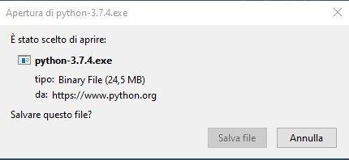
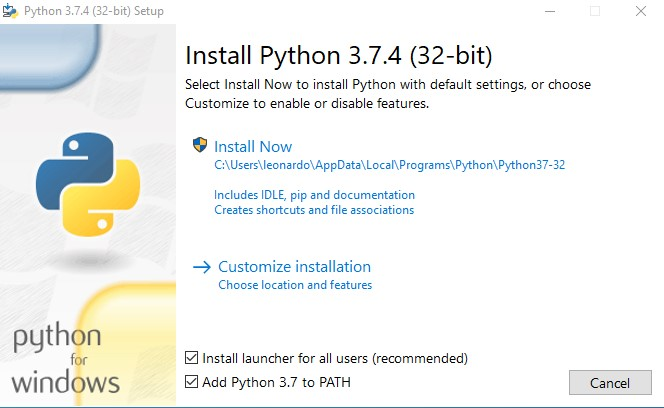
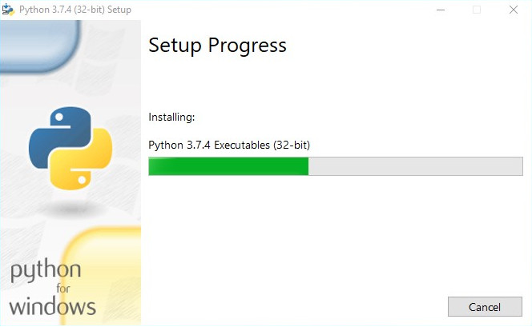
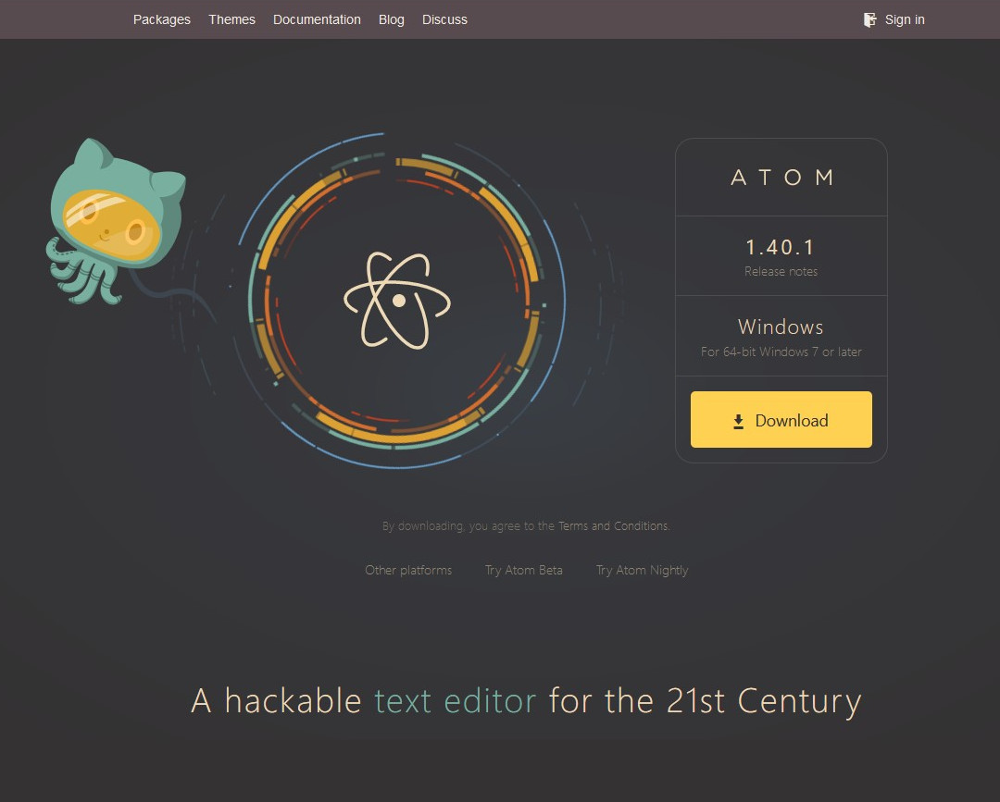
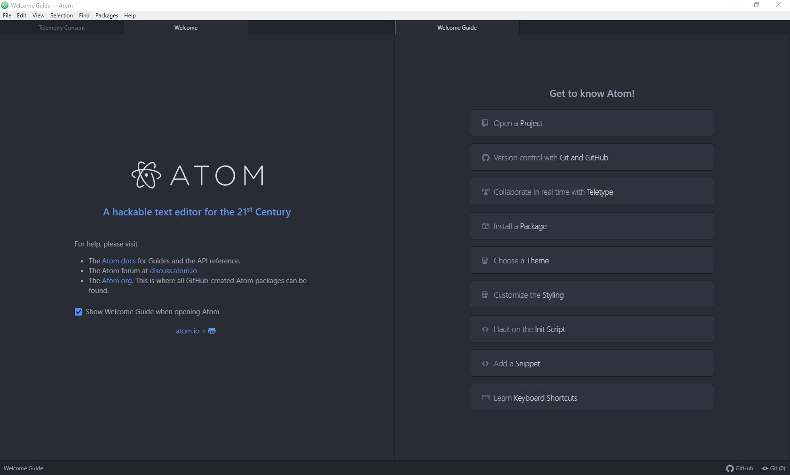

#### Pillola informatica #4

Oggi ci mettiamo nelle condizioni di poter iniziare a scrivere dei programmi con l'ormai famigerato linguaggio **python**. La prima cosa da fare quindi è installarlo sul nostro computer in modo da trovarci un ambiente all'interno del quale poter far girare l'**interprete** e dargli in pasto i sorgenti dei programmi che andremo a scrivere.

Senza ulteriori indugi, apriamo il nostro browser e andiamo all'indirizzo:
https://www.python.org/downloads/

Al quale troveremo una schermata molto simile a questa:

<!-- 

 -->

A questo punto clicchiamo su **Download Python 3.7.x** dove *x* è un altro numero. Nell'immagine è riportato il 4 ma non è detto che nel giro di poco venga rilasciata un'altra versione. Non è comunque qualcosa di cui preoccuparci al momento.

Dopo aver cliccato, il sistema dovrebbe proporci qualcosa di simile:
<!--  -->

A questo punto clicchiamo su **Salva file** ed attendiamo la fine del download. Una volta concluso andiamo nella cartella Downloads del pc (o quella impostata nel browser per il download dei file) e lanciamo il file **python-3.7.x.exe** che abbiamo scaricato.  [**nota:** è possibile anche lanciarlo direttamente dal broser, basta andare nell'elenco dei download e cliccarci su].

Una volta lanciato ci troveremo davanti qualcosa di questo tipo:

<!--  -->

**ATTENZIONE:** Prima di cliccare su *Install Now* e cominciare l'installazione è conveniente mettere la spunta su  
 *__"Add Python 3.7 to PATH"__* , questa operazione dirà al sistema dove viene installato tutto il materiale relativo a *python*, permettendoci così di utilizzarlo da linea di comando (lo vediamo fra un attimo) senza doverci preoccupare di specificare il percorso tutte le volte (che sarebbe uno sbattimento immane, al punto di far passare la vogliadi programmare). Prima di procedere quindi, verifichiamo di aver messo la spunta:

 <!--  -->

Ora siamo pronti per cliccare finalmente su **Install Now**. Una volta fatto dovremo avere un po' di pazienza ed aspettare che sia tutto finito, l'installer ci informerà del progesso con una sipatica barra verde, come quella qui sotto:

<!--  -->

Una volta concluso la finestra cambierà avvisandoci che tutto è andato secondo i piani:

<!--  -->

A questo punto, per verificare che tutto abbia funzionato correttamente e di aver eseguito i passaggi nel modo giusto possiamo fare 2 cose:

- Apriamo il **Menu Start** di *Windows* e controlliamo se nelle applicazioni aggiunte di recente è comparso qualcosa di relativo a **python** , dovremmo avere qualcosa di simile:

<!--  -->

&nbsp;&nbsp;&nbsp;&nbsp;&nbsp;&nbsp;&nbsp;&nbsp;&nbsp;&nbsp;
se così fosse saremmo già sulla buona strada, ma possiamo effettuare (anche direttamente volendo) un altro &nbsp;&nbsp;&nbsp;&nbsp;&nbsp;&nbsp;&nbsp;&nbsp;&nbsp;&nbsp;
controllo.

- Apriamo il famoso **Prompt dei comandi** conosciuto anche come **cmd**, ci troveremo davanti la più temuta (da parte di chi non è ancora navigato) delle finestre, qualcosa di simile:

<!--  -->

A questo punto digitiamo **python** a lina di comando e poi premiamo **[Invio]**.

<!--  -->

Se l'installazione di **python** è andata a buon fine ci troveremo davanti una scritta con informazioni di diversa natura, tra cui la versione di python installata, a dimostrazione del fatto che l'interprete python è stato trovato ed è pronto ad eseguire i nostri comandi.

<!--  -->

**CONGRATULAZIONI!** Adesso siamo (quasi) in grado di scrivere dei programmi e automatizzare un sacco di operazioni noiose :)

#### Bonus: Installazione di atom

In precedenza abbiamo visto che i *sorgenti* di un programma sono costituiti da dei file di testo. Per scrivere in questi file abbiamo bisogno quindi di un **Editor**, cioè un programma per scrivere. Qualcuno potrebbe pensare al classico *Word*, ma quest'ultimo in realtà non va bene. Questo perchè *Word* non si limita a scrivere il testo che digitiamo dentro al file, ma aggiunge dei dati che gli servono per gestire correttamente la formattazione del testo e un sacco di altra roba che all'*interprete python* (ma anche ad un compilatore) darebbe fastidio, impedendoci di raggiungere il risultato sperato.

Un'alternativa percorribile potrebbe essere quella di utilizzare il **Blocco note** di *Windows* , ma in questo caso avremmo solo un foglio bianco e spoglio che non ci darebbe alcun tipo di aiuto a capire meglio cosa stiamo scrivendo.

Per ovviare a questi problemi la soluzione che ti propongo è quella di utilizzare **Atom** , un editor di testo molto potente e molto flessibile, creato dai programmatori per i programmatori. Presenta molti difetti (tra i quali le prestazioni non esattamente eccellenti), ma supporta nativamente molti linguaggi (tra cui python) senza bisogno di effettuare alcun setup particolare ed è molto molto semplice da installare, motivo per cui l'ho trovato adatto per quello che dobbiamo fare.

In modo molto simile a *python*, come prima cosa vai con il browser all'indirizzo: https://atom.io/ dove vedrai qualcosa di molto simile:

<!--  -->

A questo punto ti verrà chiesto di confermare il download in modo simile a prima:

<!--  -->

Confermiamo il download e lanciamo l'eseguibile, a questo punto partirà automaticamente l'installazione, con una simpatica animazione che indica che l'installazione di Atom è in corso e che una volta terminata il programma verrà avviato automaticamente:

<!--  -->

Una volta terminata l'installazione **Atom** si avvierà e dovremmo trovarci davanti qualcosa del genere:

<!--  -->

Adesso siamo veramente pronti per programmare!

**NOTA BENE:** Atom non è l'unico editor in circolazione che si utilizza per programmare. Ce ne sono un sacco e di diversa natura, ma questo è completamente gratuito, *open source* (vedremo cosa vuol dire più avanti) e, ultimo ma non meno importante, io lo uso per lavorare (e per scrivere le pillole), il che ci permette di lavorare con lo stesso strumento e quindi posso darti una mano con le sue funzioni se ne avessi bisogno. Ma vediamo come installarlo.

Nella prossima puntata vedremo un paio di funzioni utili per cominciare ad utilizzare *Atom* e come scrivere il nostro primo programma in **python** !
