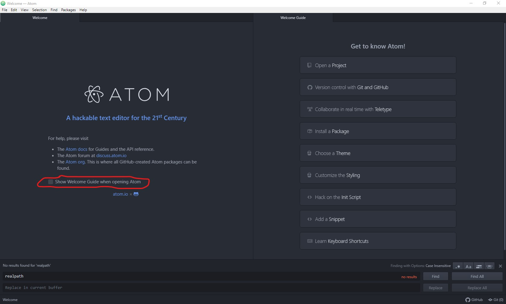
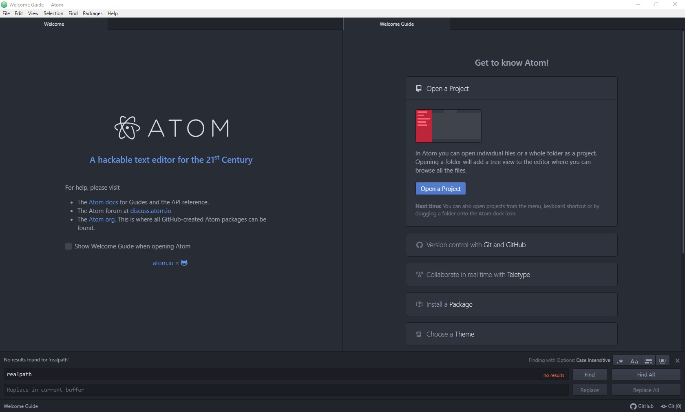
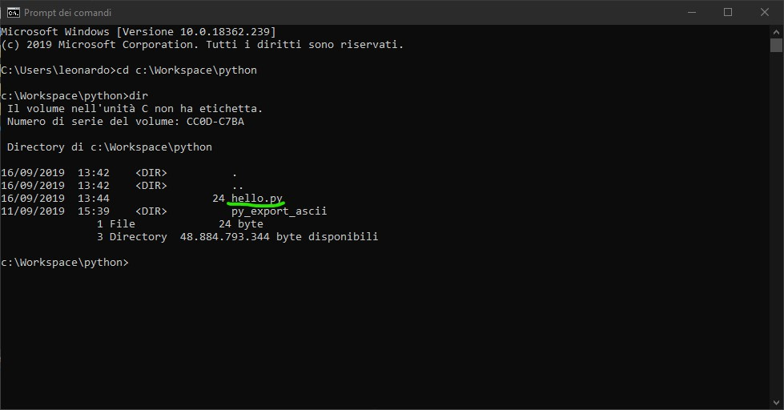

#### Pillola informatica #5

La volta scorsa ci siamo lasciati con **python** ed **atom** freschi di installazione e quest'ultimo aperto e pronto all'uso. Oggi vediamo quindi come effettuare un primo mini-setup di un progetto e come iniziare a lavorare con python scrivendo il nostro **primo script**.

Riprendiamo da dove eravamo rimasti e apriamo **atom** , dovremmo trovarci davanti qualcosa di molto simile a quest'immagine:

<!--  -->
<div style="text-align:center"></div>
<div/>

La prima cosa che possiamo scegliere di fare (ed io personalmente lo faccio sempre) è disabilitare la pagina di benvenuto per i prossimi accessi, in modo da avere atom subito pronto all'uso quando viene aperto senza dover eseguire passaggi in più. Se volessimo farlo basterebbe semplicemente togliere la spunta da *__Show Welcome Guide when opening Atom__* che troviamo nel pannello a sinistra, circa al centro. Come visibile qui sotto:

<!--  -->
<div style="text-align:center"></div>
<div/>

A questo punto andiamo a crearci uno spazio di lavoro: una cartella dove salvare i nostri file sorgenti e poter gestire tutti i progetti. Facciamo *click* su **Open a Project** nel pannello di destra, vedremo espandersi il menu nel modo seguente:

<!--  -->
<div style="text-align:center"></div>
<div/>

Adesso possiamo cliccare sul **tasto blu** che riporta la stessa scritta di prima, vedremo aprirsi una finestra del *file explorer* di Windows che ci invita a scegliere una cartella:

<!--  -->
<div style="text-align:center"></div>
<div/>

Personalmente io mi trovo bene ad avere una cartella **Workspace** piazzata in **C:\** (ovvero la cartella radice del disco), che poi solitamente divido in sottocartelle per linguaggio [non è una distinzione che funziona sempre, ma i dettagli li vediamo più avanti], nell'esempio quindi è riportata la cartella che ho scelto. Se non dovessi avere una cartella che vuoi utilizzare col tasto destro del mouse, andando su *Nuovo* puoi creare una nuova cartella nella posizione che più ti aggrada. Una volta aperta la cartella che vuoi utilizzare come workspace non devi far altro che cliccare su *__Selezione cartella__* ed all'interno di **atom** comparirà, sulla sinistra, il *project explorer*, che non è altro che una vista ad albero della cartella che hai selezionato. Avrai quindi qualcosa di simile a questo:

<!--  -->
<div style="text-align:center"></div>
<div/>

Nella mia cartella è già presente un progetto che avevo creato in precedenza, la tua dovrebbe invece risultare vuota. Creiamo adesso un primo script *python* e facciamolo girare. Clicca col tasto detro sulla cartella del progetto, comparirà un menu a scomparsa come il seguente:

<!--  -->
<div style="text-align:center"></div>
<div/>

A questo punto clicca sulla voce *__"New File"__* , ti verrà presentato un campo di testo in cui inserire il nome del file da creare. Nel mio caso ho scelto **Hello.py** . Una volta digitato il nome che hai scelto, premi **< Invio >** , il campo di testo scomparirà e vedrai il tuo file apparire nel *project explorer*, sintomo del fatto che è stato creato correttamente. Non ci resta che aprirlo con un *doppio click* e scrivervi all'interno il codice **python** del nostro script.

Oggi facciamo solo un programmino di prova, **stampiamo a video** una scritta. Il codice per farlo è semplicemente questo:

```python
print("Hello python!")
```
una volta scritto salviamo premendo **< Ctrl > + s**  oppure dal menu *File -> Save*

Non ci resta quindi che testare il nostro programma per verificare che funzioni. Apriamo il *prompt dei comandi* di Windows come abbiamo fatto l'altra volta e spostiamoci nella cartella opportuna utilizzando il comando **cd** (che sta per **Change directory**), nel mio caso il comando sarà quindi :

```powershell
cd C:\Workspace\python
```

**NOTA:** *io piazzo sempre il Worskpace in C:\ proprio perchè così non devo digitare percorsi lunghi (e potenzialmente complicati e difficili da ricordare) quando mi muovo col prompt.*

Una volta digitato e premuto **< Invio >** dovremo essere nella cartella del nostro progetto, per verificarlo utilizziamo il comando **dir** , che confermiamo sempre premendo **< Invio >** :

```powershell
dir
```
Una volta fatto ciò, la **shell** (altro nome del *prompt*) ci mostrerà l'elenco dei file presenti all'interno della cartella in cui ci siamo spostati. Dobbiamo verificare che nell'elenco sia presente il file che abbiamo creato poco fa, quindi avremo qualcosa di simile a questo:
<!--  -->
<div style="text-align:center"></div>
<div/>

A questo punto non dobbiamo far altro che lanciare il nostro **script** e vedere se funziona. Per farlo ci basterà dare il comando:

```powershell
python hello.py
```
Se abbiamo fatto i compiti giusti il risultato che avremo sarà qualcosa di questo tipo:

<!--  -->
<div style="text-align:center"></div>
<div/>

Il messaggio che ho sottolineato è l'**output a video** del nostro programma. Quindi, **COMPLIMENTI!** hai fatto girare il tuo primo programma in **python**!

A partire dalla prossima volta inizieremo a scrivere dei veri e propri programmi ed esploreremo il mondo della programmazione un po' più da vicino :D
