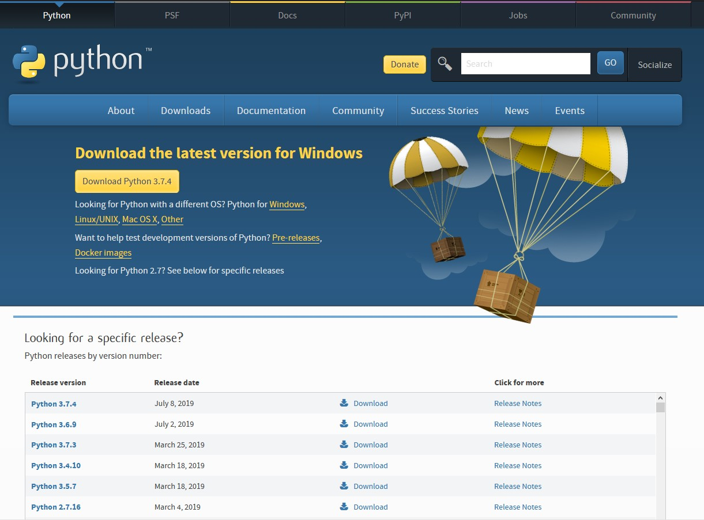

## Pillola informatica #10

Siamo arrivati ad un punto in cui sappiamo a tutti gli effetti scrivere un programma. Seppur ancora con diversi limiti, abbiamo accesso possibilità in numero veramente elevato:

- Conosciamo qualche costrutto per il controllo di flusso
- Sappiamo creare variabili
- Abbiamo a nostra disposizione le funzioni per "riciclare" del codice che può servirci in più occasioni

Adesso potremmo continuare a vedere i costrutti più comuni per iniziare a padroneggiarli. Ma **python** è un linguaggio *MOLTO GRANDE* ed esplorarlo tutto sarebbe veramente impossibile. In questa fase diventa quindi molto utile, almeno secondo me, imparare a **cercare online** quello che ci serve e capire come **leggere una documentazione** per poter utilizzare al meglio ciò che troviamo. I prossimi costrutti di base, infatti, li vediamo sotto forma di una piccola guida alla ricerca, così se dovessi trovarti nella situazione in cui hai bisogno di fare qualcosa in **python** che non hai mai fatto, avrai gli strumenti per capire che cosa fare.

Quello che cerchiamo di fare oggi quindi, è capire come si utilizza un costrutto `for` , una cosa semplice, che potremmo spiegare con qualche riga in un frammento di pillola, ma essendo molto di base, sarà anche facile capire come funziona sbirciando in rete.

Quindi, apriamo il nostro browser di fiducia e cerchiamo informazioni sul nostro motore di ricerca preferito. Nell'immagine di esempio io utilizzo [Firefox](https://www.mozilla.org/it/firefox/new/?redirect_source=firefox-com "Homepage di Firefox") come **browser** e [DuckDuckGo](https://duckduckgo.com/?atb=v191-4__ "Homepage di DuckDuckGo") come **motore di ricerca**, utilizzando le parole chiave `for python` otterremo un risultato molto simile a quanto segue:

<!-- 

 -->
Possiamo quindi scegliere un risultato tra quelli elencati.

**NB:** Personalmente quando ho bisogno di guardare qualcosa riguardo la sintassi nuda e cruda di **python**, mi piace appoggiarmi a [W3Schools](https://www.w3schools.com/python/) , è un sito di didattica che tratta anche altri linguaggi, principalmente orientato alle tecnologie web. Gli esempi non sono particolarmente esaustivi, ma di solito sono molto chiari e per una sbirciata al volo per farmi un'idea li trovo ottimi. Una cosa che non guarda mai è il fatto che sito sia facilmente navigabile e molto leggibile in termini di colori e contrasto. Un'altra feature molto molto carina di questo sito è il fatto di poter far girare (e volendo modificare) gli esempi direttamente nel browser per vedere che output restituiscono le varie istruzioni, cosa che torna molto utile se si è alle prime armi.

**NB2:** Un'altra cosa che secondo me ha molto senso fare, è quella di preferire contenuti in **lingua inglese**. Che ci piaccia o meno quella è la lingua del web e che si sceglie solitamente per comunicare fra persone di paesi diversi, ne consegue in modo quasi banale che sarà molto più probabile trovare qualcosa di utile e relativo al nostro caso (soprattutto per quanto riguarda quelli particolari) in quella lingua che non in italiano, lingua in cui è relativamente semplice trovare articoli che trattano le basi ma molto meno cose più avanzate, che ci serviranno sempre di più man mano che andiamo avanti.

A questo punto seguo quindi la mia preferenza personale e apro il risultato di [W3Schools](https://www.w3schools.com/python/).

Non appena il browser avrà finito di caricare ci troveremo davanti la seguente pagina:

<!-- 

 -->

Che và dritta al punto. Ci spiega in breve a cosa serve un `ciclo for` e mostra una serie di esempi di casi d'uso. 

Non dovrebbe essere molto difficile seguire gli esempi dato che arrivati a questo punto leggere la sintassi del python dovrebbe, a meno di cose particolari, risultare abbastanza semplice.

Sono tutte situazioni molto standard, il che ci viene decisamente in aiuto se vogliamo sfruttare il costrutto per fare cose normali. Se invece stiamo cercando qualcosa di particolare, w3schools non sarà la soluzione per noi.

***Ma cosa devo fare se ho bisogno di fare una cosa più complicata?***

In questo caso, la nostra piattaforma di riferimento diventa [StackOverflow](https://www.stackoverflow.com/) una piattaforma di condivisione sulla quale programmatori da tutto il mondo condividono problemi e soluzioni, quasi sempre corredate da codici di esempio che possiamo riutilizzare per risolvere il nostro problema.

***Ma come faccio a cercare il mio problema su StackOverflow?***

Il modo più semplice è quello di affidarsi al **motore di ricerca**: digitiamo quello che vogliamo fare ed il linguaggio in cui vogliamo farlo, è molto probabile che tra i primi risultati ci sia un link di stackoverflow con una domanda simile alla nostra, e se siamo fortunati (e la fortuna di cui avremo bisogno è proporzionale alla particolarità del caso che abbiamo in esame) troveremo una risposta che ci dirà cosa fare.

Quindi, tanto per fare un esempio pratico, supponiamo di voler *stampare l'ultimo elemento di una lista* in **python**. Facciamo come prima e digitiamo: 

`python print last element of list`

La ricerca che ci spunterà fuori sarà qualcosa di simile a questo:

Come possiamo vedere, **DuckDuckGo** ha anche un'integrazione particolare con stackoverflow e ci fa una proposta di post sulla destra con una soluzione, ma lo stesso link lo troviamo anche in elenco. Proviamo ad aprirla, e ciò che otteniamo è questo:

Leggendo velocemente vediamo subito che il contenuto è fatto da almeno 2 elementi:

- Una domanda simile alla nostra postata da un utente
- Una risposta con del codice

Un elemento interessante a cui fare caso è la spunta verde sulla sinista. Quel simbolo indica che l'utente che ha posto la domanda ha marcato quella risposta come utile a risolvere il problema da lui posto. Se quindi il nostro caso è lo stesso, o simile, alla domanda del post diventa molto probabile che in quella risposta troveremo qualcosa di utile per noi.

Nulla vieta, poi, di iscriverci al sito, porre noi stessi una domanda e aspettare una risposta da parte di qualcuno più esperto di noi.

Se la risposta che ha risolto il problema dell'utente che ha posto la domanda non è utile per noi, non demordiamo, scorriamo la pagina e vediamo se qualcun altro ha postato qualcosa che potrebbe esserci utile e, se anche questo non dovesse rivelarsi utile, proviamo ad effettuare nuovamente una ricerca a partire dal nostro motore ponendo la domanda in modo diverso.

**NB3:** Quelli proposti qui sono solo 2 dei siti che utilizzo di più, ma il web è pieno di soluzioni ed di siti in cui sbirciare. In generale la regola è: se c'è del codice, potrebbe servirmi, quindi vale la pena dare almeno una letta rapida.

Ora che sappiamo come "volare da soli" è arrivato il momento per iniziare a cercare di fare un programma con la nostra testa, e quindi:

#### COMPITI: Calcolatrice a linea di comando

Utilizzando la **funzione di calcolo** che abbiamo scritto nelle utile pillole ed i costrutti che abbiamo imparato (**if**, **while**, **for**), cerchiamo di scrivere un programma che permetta di fare i calcoli in quantità indeterminata fino a che l'utente non decide di uscire. Il programma deve quindi fare le seguenti operazioni:

- Chiedere all'utente di inserire l'operazione da effettuare
- Se l'operazione è eseguibile, calcolarne il risultato e mostrarlo
- Se l'operazione non è eseguibile, mostrare un messaggio errore
- In entrambi i casi, chiedere all'utente di inserire un'altra operazione da calcolare
- Se l'utente inserisce il carattere `q` e preme **< INVIO >** il programma deve mostrare un messaggio di uscita e terminare
- Se l'utente inserisce il carattere `h` e preme **< INVIO >** mostrare un messaggio di "help" che spiega come funziona il programma (Facoltativo, da fare per ultimo)