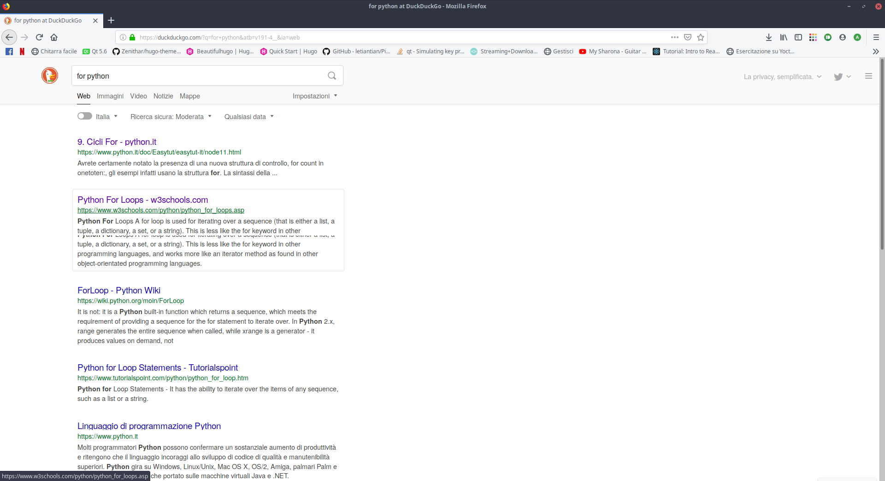
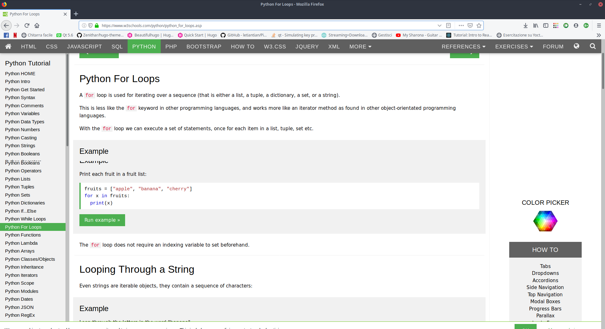

### Indice:
- [0 - Introduzione ai linguaggi di programmazione](#0---introduzione-ai-linguaggi-di-programmazione)
- [1 - Com'è fatto un programma: variabili, statement ed espressioni](#1---comè-fatto-un-programma-variabili-statement-ed-espressioni)
- [2 - Introduzione al pc, ai tipi di dato e ai costrutti in python](#2---introduzione-al-pc-ai-tipi-di-dato-e-ai-costrutti-in-python)
- [3 - Funzioni ed oggetti](#3---funzioni-ed-oggetti)
- [4 - Installiamo python (su Windows)](#4---installiamo-python-su-windows)
    - [BONUS: Installazione di atom](#bonus-installazione-di-atom)
- [5 - Hello python!](#5---hello-python)
- [6 - Risolutore di calcoli](#6---risolutore-di-calcoli)
- [7 - Definiamo una funzione](#7---definiamo-una-funzione)
- [8 - Funzioni: scaviamo più a fondo](#8---funzioni-scaviamo-più-a-fondo)
- [9 - Visibilità delle variabili](#9---visibilità-delle-variabili)
- [10 - Cercare documentazione online](#10---cercare-documentazione-online)
    - [COMPITI: Calcolatrice a linea di comando](#compiti-calcolatrice-a-linea-di-comando)
- [11 - Estrarre informazioni dalle stringhe](#11---estrarre-informazioni-dalle-stringhe)
## 0 - Introduzione ai linguaggi di programmazione

Partiamo dal primo *concetto fondamentale* senza in quale non ci sarebbe possibile proseguire col resto:
- un computer è un attrezzo stupido che fa calcoli
- fa sempre e solo ciò che gli si dice di fare.
- è molto molto rapido ad eseguire i suddetti calcoli

Quindi possiamo fargli fare un'infinità di operazioni tutte in fila (per semplicità diciamo una alla volta, non è sempre così ma per quello che ci serve possiamo assumere che le faccia una per una)
Detto ciò viene da sé che scrivere un software non è altro che "dire al pc una serie di calcoli che vogliamo che faccia". Immagino che la domanda sorga spontanea: *\"ok, ma come faccio ?!?\"* . Senza scendere in dettagli che riguardano l'elettronica, ricordiamo al volo che il computer sa ragionare solo **0** ed **1**, il famoso *__codice binario__*. Ci sono tutta una serie di regole poco utili al momento che ci permettono di passare da un linguaggio comprensibile agli umani a quello comprensibile al computer: questo tipo di operazione si chiama compilazione ,  in pratica c'è un software (che con molta fantasia si chiama compilatore) che prende un file di testo (come quelli che vedi nello screenshot di sopra, in particolare quello a sinistra, quello a destra ha regole un po' diverse, ma ci arriviamo fra un attimo) che si occupa di leggere e tradurre quel testo (detto sorgente) in un file fatto di 0 ed 1 comprensibile e pronto per essere eseguito (eseguibile). Questo è quello che succede, per esempio, con i file scritti in linguaggio C (quello dell'esempio), **C++**, **Java** e con tutti quei linguaggi che appartengono alla grande famiglia dei *__linguaggi compilati__*. Quindi, volendo riassumere, succede una cosa di questo tipo:
*Scrivo file sorgente -> compilatore [più altra roba che non ci serve] -> eseguibile -> PC fa girare il programma*.

Diciamo che questo è il modo *\"classico\"* di far le cose, ma la tecnologia evolve ed è successo (già decenni fa) che qualcuno volesse fare le cose in maniera un pochettino più "snella" in un certo senso, quindi menzioniamo quelli che sono i cosiddetti *__linguaggi interpretati__* , l'esempio principe e che hai già sentito nominare (ed è quello dello screenshot a destra) è il **python**, ma tanto per aggiungere un paio di esempi famosi possiamo citare **javascript** e **php**. In questo caso quello che succede è che c'è un software che si chiama interprete che si va a leggere il tuo file sorgente e fa eseguire direttamente i comandi al pc *man mano che li legge*.

I due approcci di cui sopra sono molto diversi ed ognuno presenta i suoi vantaggi ed i suoi svantaggi, ma magari questi li discutiamo quando siamo un po' più dentro l'argomento. Però distinguiamo 2 situazioni abbastanza tipiche in cui si sceglie uno o l'altro approccio. Tenendo conto che non è una legge universale che vale dappertutto, ogni situazione va gestita poi di volta in volta, possiamo dire che:
- Quando hai bisogno di un software che abbia *prestazioni molto elevate* pur facendo un botto di calcoli è molto probabile che la via giusta sia un linguaggio compilato
- Quando hai bisogno di un software da *mettere in campo alla svelta perdendo poco tempo per scriverlo* un linguaggio interpretato ti permette di fare generalmente prima

## 1 - Com'è fatto un programma: variabili, statement ed espressioni

Facciamo una breve carrellata di quelli che sono gli **elementi** che compongono un **programma**. Non ci aiuteranno ancora del tutto a capire come scriverne uno, ma possiamo pensarla come una piccola *raccolta* di parole chiave generiche che pongono le basi per andare più spediti mentre procediamo in questo viaggio. Cominciamo quindi col dire cos'è una **variabile**: senza appellarci a concetti strani, una variabile *di fatto* è una *scatola*, un contenitore che possiamo utilizzare per *\"mettere da parte\"* qualcosa ed utilizzarlo in un secondo momento e, come dice anche il nome, **può cambiare nel tempo**.

Facciamo un esempietto di applicazione di questa cosa: vogliamo fare un programma che *calcola l'area di un cerchio* il cui raggio non ci è noto a priori perché vogliamo che venga inserito dall'utente via tastiera. Senza entrare nei dettagli dell'inserimento da tastiera e della visualizzazione del risultato, ci concentriamo un attimo sulla formula, come si fa in matematica. La formula sarà quindi -> *__area = 3.1415 * r * r__*. Viene facile vedere che in questo caso, le variabili che utilizziamo sono 2: area e raggio , che non sono altro che le "scatole" in cui andremo a mettere:

1. Il valore del raggio che ci fornisce l'utente

2. Il risultato del calcolo, che useremo più avanti per fare altre cose fichissime

Capito cosa sono le variabili, riguardiamo per un secondo la formula, perché da questa possiamo ricavare altri 2 mattoncini che compongono, a livello logico, un programma, in particolare guardiamola secondo questo punto di vista:
*__3.1415 * r * r__* , questa è ciò che viene detta **espressione** (e si torna alle medie di cattiveria) , ed è di fatto una roba che una volta che hai il numero da mettere al posto delle lettere puoi calcolare a tutti gli effetti ed ottenere un *risultato*. Fare questo tipo di calcolo si dice in gergo tecnico *__valutare l'espressione__* , che è appunto una formuletta che ci fornisce un risultato.

Il terzo mattoncino che ci serve lo vediamo sempre riprendendo la formuletta di prima, ma stavolta guardandola così:
*__qualcosa = qualcos'altro__*
questo è ciò che viene chiamato uno **statement** , che in italiano traduciamo spesso con **istruzione** , ma a livello logico sarebbe più corretto chiamarla *\"affermazione\"* , in pratica stai dicendo al pc *\"fai questo"\* , che volendo analizzarlo più nel dettaglio possiamo tradurre in:
" metti dentro alla variabile area il risultato che ottieni valutando l'espressione *__3.1415 * r * r__* .

Com'è ovvio che sia, ci sono praticamente *infinite espressioni ed infiniti statement possibili*, ma, in linea di massima, con queste 3 cose (**variabili**, **statement** ed **espressioni**) siamo virtualmente in grado di scrivere a livello di software qualsiasi cosa ci piaccia, darla in pasto ad un computer e farglielo eseguire. Mi rendo conto che adesso è ancora un po' tutto fumoso, ma un pezzetto alla volta spero di fare chiarezza. Con la prossima pillola recap di come funziona tutto l'accrocchio PC ed iniziamo a parlare in modo molto vago di **python**, così poi gli esempi possiamo farli scrivendoli in quel linguaggio, che è a mio modo di vedere di cose il più semplice per cominciare.


## 2 - Introduzione al pc, ai tipi di dato e ai costrutti in python

Ripartiamo dalla puntata precedente e facciamo un piccolo recap di un paio di concetti che mi sembra utile tenere sotto mano prima di proseguire col resto. Vediamo velocemente *com'è fatto un computer*, poi, in ultima battuta, iniziamo a parlare di **python** come strumento per scrivere programmi.

In soldoni, senza rifarci troppo a nomi altisonanti della teoria dell'informatica, un computer è fatto, *__a livello logico__*, di 3 *"pezzi"* fondamentali di cui dobbiamo tenere conto quando facciamo i programmi:
- L'**unità di calcolo** (conosciuta anche come *processore* o *CPU*), brutalmente un sasso appiattito coi fulmini dentro. E' il *cervello* ed colui che esegue davvero le istruzioni che vogliamo far fare al computer.
- La **memoria centrale** (la *ram*, il posto in cui il computer tiene tutto quello che sta maneggiando mentre esegue un programma)
- La **memoria di massa** (detta spesso anche storage o "hard disk") è dove vengono salvati i file che possiamo leggere e/o utilizzare.

Quando lo accendiamo, il computer fa letteralmente (anche se descritte MOOOLTO a spanne) questa serie di operazioni:

- Va a cercare nella **memoria di massa** la roba che gli serve per funzionare
- Carica quella roba in **memoria centrale**
- Esegue tutto quello che deve eseguire secondo questa logica:
  - *leggi istruzione*
  - *esegui istruzione*
  - *leggi istruzione*
  - *esegui istruzione*
  - etc. etc.

Ora, un linguaggio come il **C** richiede al programmatore di sapere con un certo grado di dettaglio com'è fatta la struttura logica della memoria centrale e qualche altro dettaglio, ma al momento stiamo parlando di *programmazione* e non di *architettura dei calcolatori*, quindi questa parte, almeno per ora, ce la risparmiamo.

In nostro soccorso viene **python**, che si smazza tutta la gestione della memoria da solo nelle retrovie, col risultato che possiamo preoccuparci di meno di combattere col computer e possiamo concentrarci sul problema che il nostro programma deve risolvere.

La parte difficile della programmazione non è tanto scrivere le azioni che il PC deve fare in sé e per sé, lo è molto di più *__organizzare le informazioni__* del nostro problema in modo tale per cui risulti rappresentabile in modo comprensibile tanto per noi quanto per il computer che, ricordiamolo, è una macchina **stupida**, ed essendo stupido ha bisogno di partire da alcuni elementi fondamentali per rappresentare i dati in modo semplice, starà poi a noi organizzarli in modo opportuno per tirare fuori ragionamenti complessi. Vediamo quindi quali sono i tipi di dato fondamentali che python ci permette di utilizzare per fare quello che ci interessa.
- **Numeri interi** , detti int, che sono i numeri col segno: 3, 4, 5, -1, -2 etc.
- **Numeri reali** , detti float (da floating point, virgola mobile), che sono i numeri con la virgola e anche il segno, rappresentabili in 102308094328 modi diversi, ma ora non ci interessa.
- **Stringhe** , brutalmente "pezzi di testo" racchiusi tra virgolette, queste vengono interpretate alla "parla come mangi" cioè col testo che ci scrivi dentro.
- **Booleani** , variabili binarie che possono assumere "True" o "False" e servono per implementare tutta la logica tradizionale a livello di codice
- **Liste** , sequenze di dati, per esempio una lista di int, sono tanti numeri, messi in fila, che possiamo salvare dentro ad una sola variabile e portarceli in giro tutti insieme.
- **Dizionari** , questo è più complicato, magari lo trattiamo a parte, ma ricordiamoci che c'è.

Ci sono poi i costrutti logici, che sono quelli che ci permettono di esprimere dei "pezzi di ragionamento" che il nostro programma può fare per cambiare comportamento a seconda di alcune condizioni che saremo noi a definire. Ne vediamo **3**:

- Costrutto: **if** *condizione* **:** *allora fai X* **else :** *fai Y* , dovrebbe essere abbastanza 1:1 capire cosa fa, se *__"condizione"__* (che, facendo riferimento alla pillola di ieri, sarà un'espressione che una volta valutata dà un valore booleano) è  verificata, quindi il **booleano** di cui sopra ha valore **True**, allora esegue il pezzo di codice X, al contrario se il booleano ha valore False viene eseguito il pezzo di codice Y.
- Costrutto: **for** , non ne vediamo la sintassi perchè si può fare in un sacco di modi, ma sostanzialmente si scorre un **elenco** e *__per ogni elemento dell'elenco__* si fa ciò che c'è scritto dopo il for, serve quindi per ripetere delle parti di codice per un certo numero di volte. Vediamo un esempio nella prossima pillola, è più semplice di quanto si pensa.
- Costrutto **while** , anche questo serve per ripetere parti di codice, ma invece che scorrere un elenco gli si specifica una **condizione** (come nel caso dell'if) ed il codice che segue viene ripetuto *__finchè tale condizione è vera__*. Nel momento in cui la condizione diventa falsa le ripetizioni cessano ed il programma va avanti. Anche per questo costrutto vediamo un esempio la prossima volta.


## 3 - Funzioni ed oggetti

Vediamo gli ultimi 2 concetti puramente teorici riguardo la **programmazione in generale**, ma che sono concetti cardine per quanto riguarda **python**, senza avere almeno idea di cosa siano ci sarebbe impossibile capire quello che stiamo facendo.
Iniziamo quindi col dire cos'è una **funzione**:
rifacendoci alla buona vecchia definizione *matematica*, una funzione la possiamo descrivere in questo modo:  *__y = f(x)__* ,
se la guardi così sai benissimo che **f** è una formuletta che fa diverse operazioni su **x** e la *"macina"* fino a che non ottieni un valore, che è il tuo *y*.

In informatica funziona esattamente allo stesso identico modo, solo che al posto di operazioni prettamente matematiche la nostra *"f"* può essere composta da un *mix di operazioni* che abbiamo visto durante la pillola scorsa e come risultato ritorna un (o più, ma lo vedremo scrivendo del python) **valore** che puoi mettere dentro ad una **variabile** e riutilizzare in un secondo momento.
Probabilmente in matematica hai visto, magari anche solo di sfuggita, anche cose di questo tipo: **z = f(x, y)** , dove la funzione prende come **argomenti** due valori distinti.
Come ultima cosa ricordiamo che f è soltanto una specie di etichetta con cui identifichiamo quello che fa la nostra funzione. (Sempre tornando alla matematica, sicuramente avrai visto robe come: *__y = cos(x)__* )

Viene abbastanza da sé che le funzioni ci fanno comodo nel momento in cui vogliamo una *"fetta di codice"* da poter riutilizzare ogni volta che ci serve cambiandone solo i **parametri in ingresso** (cioè scrivendo qualcosa al posto della x, per ottenere y).
Facciamo quindi un veloce esempio di come possiamo definire una funzione (l'esempio è in python, in altri linguaggi cambia qualche sfumatura, ma la sostanza è abbastanza universale) che possiamo riutilizzare quante vogliamo:

```python
def calcolo(a, b, mode):
    if mode == '+' :
        return a+b
    else:
       return a-b
```

Questo è un esempio di una piccola **funzione** che, prendendo in ingresso **3 argomenti**, in particolare **2 numeri** ed **1 carattere** testuale, restituisce come risultato la somma o la sottrazione dei 2 numeri dati in ingresso a seconda del valore dell'argomento (detto anche parametro) mode. Una volta che nel nostro programma abbiamo definito questa funzione, la possiamo utilizzare semplicemente chiamandola col suo nome e passandovi gli argomenti su cui ci interessa che essa operi. Ad esempio:

```python
k = calcolo(5 , 13, '+')
h = calcolo(15, 5, '*')
```

Come piccolo esercizio ti chiedo di calcolare quanto valgono k e h, così possiamo verificare se hai capito.

Il *concetto numero 2*, che ci tormenterà per diverso tempo, è quello di **oggetto**, in pratica un oggetto puoi immaginartelo come una specie di *"strumento"*, che ha dei *dati interni* (detti **campi**) ed espone delle *funzioni* (dette **metodi**) che ti permettono di interagire con l'oggetto. Facciamo un esempio semi-pratico e analizziamo il *__Clini5__* secondo questo punto di vista.

Il **Clini5**, semplificando molto, ha:
- Un *__database clienti__* che puoi consultare
- Un *__database risultati__* che puoi consultare
- Può *__eseguire dei test__*

Quindi, immaginando di avere creato in modo opportuno (lo vediamo più avanti come si fa) un oggetto Clini5 noi nel nostro programma python potremo fare qualcosa del genere:

```python
print(Clini5.clienti)
print(Clini5.risultati)
Clini5.do_glicata(sangue_di_tiziocaio)
```

per consultare i *"campi"* **clienti** e **risultati** ed utilizzare il *"metodo"* **do_glicata()**

Soprattutto ques'ultima parte mi rendo conto sia molto molto fumosa, ma la svisceriamo piano piano man mano che programmiamo perché si tratta di un capitolo enorme e coprirlo tutto in una pillola sola sarebbe impossibile. Per ora concentrati sul capire le funzioni e sul fatto che se abbiamo un oggetto (e in **python** letteralmente **TUTTO è un oggetto**) accediamo alle sue proprietà (campi e metodi) utilizzando l'operatore "**.**" (**punto**).


## 4 - Installiamo python (su Windows)

Oggi ci mettiamo nelle condizioni di poter iniziare a scrivere dei programmi con l'ormai famigerato linguaggio **python**. La prima cosa da fare quindi è installarlo sul nostro computer in modo da trovarci un ambiente all'interno del quale poter far girare l'**interprete** e dargli in pasto i sorgenti dei programmi che andremo a scrivere.

Senza ulteriori indugi, apriamo il nostro browser e andiamo all'indirizzo:
https://www.python.org/downloads/

Al quale troveremo una schermata molto simile a questa:


<!-- <div style="text-align:center"></div> -->

A questo punto clicchiamo su **Download Python 3.7.x** dove *x* è un altro numero. Nell'immagine è riportato il 4 ma non è detto che nel giro di poco venga rilasciata un'altra versione. Non è comunque qualcosa di cui preoccuparci al momento.

Dopo aver cliccato, il sistema dovrebbe proporci qualcosa di simile:
<!--  -->
<div style="text-align:center"></div>
<div/>
A questo punto clicchiamo su **Salva file** ed attendiamo la fine del download. Una volta concluso andiamo nella cartella Downloads del pc (o quella impostata nel browser per il download dei file) e lanciamo il file **python-3.7.x.exe** che abbiamo scaricato.  [**nota:** è possibile anche lanciarlo direttamente dal broser, basta andare nell'elenco dei download e cliccarci su].

Una volta lanciato ci troveremo davanti qualcosa di questo tipo:

<!--  -->
<div style="text-align:center"></div>
<div/>

**ATTENZIONE:** Prima di cliccare su *Install Now* e cominciare l'installazione è conveniente mettere la spunta su  
 *__"Add Python 3.7 to PATH"__* , questa operazione dirà al sistema dove viene installato tutto il materiale relativo a *python*, permettendoci così di utilizzarlo da linea di comando (lo vediamo fra un attimo) senza doverci preoccupare di specificare il percorso tutte le volte (che sarebbe uno sbattimento immane, al punto di far passare la vogliadi programmare). Prima di procedere quindi, verifichiamo di aver messo la spunta:

 <!--  -->
<div style="text-align:center"></div>
<div/>

Ora siamo pronti per cliccare finalmente su **Install Now**. Una volta fatto dovremo avere un po' di pazienza ed aspettare che sia tutto finito, l'installer ci informerà del progesso con una sipatica barra verde, come quella qui sotto:

<!--  -->
<div style="text-align:center"></div>
<div/>

Una volta concluso la finestra cambierà avvisandoci che tutto è andato secondo i piani:

<!--  -->
<div style="text-align:center"></div>
<div/>

A questo punto, per verificare che tutto abbia funzionato correttamente e di aver eseguito i passaggi nel modo giusto possiamo fare 2 cose:

- Apriamo il **Menu Start** di *Windows* e controlliamo se nelle applicazioni aggiunte di recente è comparso qualcosa di relativo a **python** , dovremmo avere qualcosa di simile:

<!--  -->
<div style="text-align:center"></div>
<div/>

&nbsp;&nbsp;&nbsp;&nbsp;&nbsp;&nbsp;&nbsp;&nbsp;&nbsp;&nbsp;
se così fosse saremmo già sulla buona strada, ma possiamo effettuare (anche direttamente volendo) un altro &nbsp;&nbsp;&nbsp;&nbsp;&nbsp;&nbsp;&nbsp;&nbsp;&nbsp;&nbsp;
controllo.

- Apriamo il famoso **Prompt dei comandi** conosciuto anche come **cmd**, ci troveremo davanti la più temuta (da parte di chi non è ancora navigato) delle finestre, qualcosa di simile:

<!--  -->
<div style="text-align:center"></div>
<div/>

A questo punto digitiamo **python** a lina di comando e poi premiamo **[Invio]**.

<!--  -->
<div style="text-align:center"></div>
<div/>

Se l'installazione di **python** è andata a buon fine ci troveremo davanti una scritta con informazioni di diversa natura, tra cui la versione di python installata, a dimostrazione del fatto che l'interprete python è stato trovato ed è pronto ad eseguire i nostri comandi.

<!--  -->
<div style="text-align:center"></div>
<div/>

**CONGRATULAZIONI!** Adesso siamo (quasi) in grado di scrivere dei programmi e automatizzare un sacco di operazioni noiose :)

#### BONUS: Installazione di atom

In precedenza abbiamo visto che i *sorgenti* di un programma sono costituiti da dei file di testo. Per scrivere in questi file abbiamo bisogno quindi di un **Editor**, cioè un programma per scrivere. Qualcuno potrebbe pensare al classico *Word*, ma quest'ultimo in realtà non va bene. Questo perchè *Word* non si limita a scrivere il testo che digitiamo dentro al file, ma aggiunge dei dati che gli servono per gestire correttamente la formattazione del testo e un sacco di altra roba che all'*interprete python* (ma anche ad un compilatore) darebbe fastidio, impedendoci di raggiungere il risultato sperato.

Un'alternativa percorribile potrebbe essere quella di utilizzare il **Blocco note** di *Windows* , ma in questo caso avremmo solo un foglio bianco e spoglio che non ci darebbe alcun tipo di aiuto a capire meglio cosa stiamo scrivendo.

Per ovviare a questi problemi la soluzione che ti propongo è quella di utilizzare **Atom** , un editor di testo molto potente e molto flessibile, creato dai programmatori per i programmatori. Presenta molti difetti (tra i quali le prestazioni non esattamente eccellenti), ma supporta nativamente molti linguaggi (tra cui python) senza bisogno di effettuare alcun setup particolare ed è molto molto semplice da installare, motivo per cui l'ho trovato adatto per quello che dobbiamo fare.

In modo molto simile a *python*, come prima cosa vai con il browser all'indirizzo: https://atom.io/ dove vedrai qualcosa di molto simile:

<!--  -->
<div style="text-align:center"></div>
<div/>

A questo punto ti verrà chiesto di confermare il download in modo simile a prima:

<!--  -->
<div style="text-align:center"></div>
<div/>

Confermiamo il download e lanciamo l'eseguibile, a questo punto partirà automaticamente l'installazione, con una simpatica animazione che indica che l'installazione di Atom è in corso e che una volta terminata il programma verrà avviato automaticamente:

<!--  -->
<div style="text-align:center"></div>
<div/>

Una volta terminata l'installazione **Atom** si avvierà e dovremmo trovarci davanti qualcosa del genere:

<!--  -->
<div style="text-align:center"></div>
<div/>

Adesso siamo veramente pronti per programmare!

**NOTA BENE:** Atom non è l'unico editor in circolazione che si utilizza per programmare. Ce ne sono un sacco e di diversa natura, ma questo è completamente gratuito, *open source* (vedremo cosa vuol dire più avanti) e, ultimo ma non meno importante, io lo uso per lavorare (e per scrivere le pillole), il che ci permette di lavorare con lo stesso strumento e quindi posso darti una mano con le sue funzioni se ne avessi bisogno. Ma vediamo come installarlo.

Nella prossima puntata vedremo un paio di funzioni utili per cominciare ad utilizzare *Atom* e come scrivere il nostro primo programma in **python** !


## 5 - Hello python!

La volta scorsa ci siamo lasciati con **python** ed **atom** freschi di installazione e quest'ultimo aperto e pronto all'uso. Oggi vediamo quindi come effettuare un primo mini-setup di un progetto e come iniziare a lavorare con python scrivendo il nostro **primo script**.

Riprendiamo da dove eravamo rimasti e apriamo **atom** , dovremmo trovarci davanti qualcosa di molto simile a quest'immagine:

<!--  -->
<div style="text-align:center"></div>
<div/>

La prima cosa che possiamo scegliere di fare (ed io personalmente lo faccio sempre) è disabilitare la pagina di benvenuto per i prossimi accessi, in modo da avere atom subito pronto all'uso quando viene aperto senza dover eseguire passaggi in più. Se volessimo farlo basterebbe semplicemente togliere la spunta da *__Show Welcome Guide when opening Atom__* che troviamo nel pannello a sinistra, circa al centro. Come visibile qui sotto:

<!--  -->
<div style="text-align:center"></div>
<div/>

A questo punto andiamo a crearci uno spazio di lavoro: una cartella dove salvare i nostri file sorgenti e poter gestire tutti i progetti. Facciamo *click* su **Open a Project** nel pannello di destra, vedremo espandersi il menu nel modo seguente:

<!--  -->
<div style="text-align:center"></div>
<div/>

Adesso possiamo cliccare sul **tasto blu** che riporta la stessa scritta di prima, vedremo aprirsi una finestra del *file explorer* di Windows che ci invita a scegliere una cartella:

<!--  -->
<div style="text-align:center"></div>
<div/>

Personalmente io mi trovo bene ad avere una cartella **Workspace** piazzata in **C:\** (ovvero la cartella radice del disco), che poi solitamente divido in sottocartelle per linguaggio [non è una distinzione che funziona sempre, ma i dettagli li vediamo più avanti], nell'esempio quindi è riportata la cartella che ho scelto. Se non dovessi avere una cartella che vuoi utilizzare col tasto destro del mouse, andando su *Nuovo* puoi creare una nuova cartella nella posizione che più ti aggrada. Una volta aperta la cartella che vuoi utilizzare come workspace non devi far altro che cliccare su *__Selezione cartella__* ed all'interno di **atom** comparirà, sulla sinistra, il *project explorer*, che non è altro che una vista ad albero della cartella che hai selezionato. Avrai quindi qualcosa di simile a questo:

<!--  -->
<div style="text-align:center"></div>
<div/>

Nella mia cartella è già presente un progetto che avevo creato in precedenza, la tua dovrebbe invece risultare vuota. Creiamo adesso un primo script *python* e facciamolo girare. Clicca col tasto detro sulla cartella del progetto, comparirà un menu a scomparsa come il seguente:

<!--  -->
<div style="text-align:center"></div>
<div/>

A questo punto clicca sulla voce *__"New File"__* , ti verrà presentato un campo di testo in cui inserire il nome del file da creare. Nel mio caso ho scelto **Hello.py** . Una volta digitato il nome che hai scelto, premi **< Invio >** , il campo di testo scomparirà e vedrai il tuo file apparire nel *project explorer*, sintomo del fatto che è stato creato correttamente. Non ci resta che aprirlo con un *doppio click* e scrivervi all'interno il codice **python** del nostro script.

Oggi facciamo solo un programmino di prova, **stampiamo a video** una scritta. Il codice per farlo è semplicemente questo:

```python
print("Hello python!")
```
una volta scritto salviamo premendo **< Ctrl > + s**  oppure dal menu *File -> Save*

Non ci resta quindi che testare il nostro programma per verificare che funzioni. Apriamo il *prompt dei comandi* di Windows come abbiamo fatto l'altra volta e spostiamoci nella cartella opportuna utilizzando il comando **cd** (che sta per **Change directory**), nel mio caso il comando sarà quindi :

```powershell
cd C:\Workspace\python
```

**NOTA:** *io piazzo sempre il Worskpace in C:\ proprio perchè così non devo digitare percorsi lunghi (e potenzialmente complicati e difficili da ricordare) quando mi muovo col prompt.*

Una volta digitato e premuto **< Invio >** dovremo essere nella cartella del nostro progetto, per verificarlo utilizziamo il comando **dir** , che confermiamo sempre premendo **< Invio >** :

```powershell
dir
```
Una volta fatto ciò, la **shell** (altro nome del *prompt*) ci mostrerà l'elenco dei file presenti all'interno della cartella in cui ci siamo spostati. Dobbiamo verificare che nell'elenco sia presente il file che abbiamo creato poco fa, quindi avremo qualcosa di simile a questo:
<!--  -->
<div style="text-align:center"></div>
<div/>

A questo punto non dobbiamo far altro che lanciare il nostro **script** e vedere se funziona. Per farlo ci basterà dare il comando:

```powershell
python hello.py
```
Se abbiamo fatto i compiti giusti il risultato che avremo sarà qualcosa di questo tipo:

<!--  -->
<div style="text-align:center"></div>
<div/>

Il messaggio che ho sottolineato è l'**output a video** del nostro programma. Quindi, **COMPLIMENTI!** hai fatto girare il tuo primo programma in **python**!

A partire dalla prossima volta inizieremo a scrivere dei veri e propri programmi ed esploreremo il mondo della programmazione un po' più da vicino :D


## 6 - Risolutore di calcoli

Oggi comincia la vera svolta, iniziamo a fare un primo programmino che faccia realmente qualcosa. Come primo esempio ho pensato di fare un piccolo **risolutore di calcoli**. Una cosa semplice ma che ci aiuti a prendere confidenza con la stesura di codice, i primi costrutti e le prime *"pratiche comuni"* che permeano la vita di tutti i giorni quando si programma.

Prima un breve elenco di quello che impariamo a fare con questa pillola:

- Importare un modulo **python**
- Prendere in ingresso **argomenti** passati da **linea di comando**
- Indentare il codice
- Come si usa costrutto **if**

Ora che sappiamo cosa ci aspetta non indugiamo oltre e procediamo a creare un nuovo file python per andare a scrivere il nostro programma.

Per prima cosa diamoci una specifica un po' più dettagliata del nostro programma, abbiamo parlato di risolutore di calcoli, ma in particolare ciò che ci serve è:

*Un programma che legge da __linea di comando__ un'espressione e ne calcola il __risultato__.*

Vogliamo quindi che il nostro programma faccia una cosa di questo tipo:

<!--  -->
<div style="text-align:center"></div>
<div/>

come si può vedere dall'immagine, il programma 006.py ha letto le varie espressioni che gli sono state **passate** (ovvero sono state scritte dopo il suo nome) di volta in volta e ha calcolato il risultato dell'espressione corrispondente.

Per poter rendere il nostro programma capace di fare questo tipo di operazione abbiamo bisogno che esso dialogi in qualche modo col *sistema operativo*, per farlo ci basterà ricorrere al *modulo* **sys**, presente in tutte le installazioni di python. 

- **NOTA** Per rendere disponibile un **modulo** nel nostro programma ci basterà usare lo statement `import` seguito dal nome del suddetto.

scriviamo quindi nel nostro programma:

```python
import sys
```

questa direttiva ci rende disponibile tutte le **funzioni** e le **strutture dati** che stanno all'interno del modulo sys, in particolare quello che ci interessa è la **lista degli argomenti passati a linea di comando**, che si chiama **argv**.

Quest'ultima è una **lista di stringhe** che potremmo definire "speciale" in quanto non siamo noi che andiamo a crearla ma è il *sistema operativo* che ce la fornisce. Come abbiamo visto molto brevemente nella **pillola #2**, una **lista** è una sequenza di dati tutti dello stesso tipo che se ne vanno a spasso tutti insieme. In particolare in una lista ci sono degli "slot" e in ognuno di essi è presente un dato a cui possiamo accedere. In **python**, per effettuare l'accesso ai dati che ci interessano, utilizziamo la seguente sintassi:

```python
nome_lista[X]
```

dove X è la **posizione** della lista a cui vogliamo accedere.

- **NOTA:** in python le liste cominciano **sempre** da **0** !

Tornando al nostro programma, quello che ci interessa fare è quindi accedere alla lista **argv** per andare a leggere l'espressione che vogliamo calcolare. Trattandosi di una lista "speciale" vediamo velocemente com'è fatta **argv**, giusto per sapere cosa andare a cercarci dentro:

- Alla posizione **0** c'è il **nome del programma** che stiamo eseguendo (quindi, rifacendoci all'esempio dell'immagine sopra, in quel caso nella posizione **0** c'è la **stringa** "**006.py**")
- Dalla posizione **1** in avanti vengono messi *gli argomenti* del programma: ovvero *__tutte le stringhe che seguono il nome del programma separate con lo spazio come separatore__*

Sempre in relazione all'esempio dell'immagine di prima, quindi, la lista **argv** del programma sarà di **4 elementi**, a cui possiamo accedere con `sys`(nome del modulo)`.`(punto, che ci serve per dire all'interprete che vogliamo "guardare dentro" a sys)`argv`(nome della lista)`[posizione_da_leggere]`.

Se quindi facessimo uno script fatto così:

**prova.py**
```python
import sys

print(sys.argv[0])
print(sys.argv[1])
print(sys.argv[2])
print(sys.argv[3])
```

e lo lanciassimo così:

```powershell
python prova.py ciao come stai
```

avremmo in output quanto segue:

```powershell
prova.py
ciao
come
stai
```

Ora che sappiamo come leggere gli argomenti da linea di comando possiamo iniziare a scrivere il nostro **vero** programma sfruttando quello che sappiamo. 

Per poter interpretare in modo corretto un'**espressione** abbiamo bisogno, in sostanza, di 3 elementi:

- **2** *operandi* su cui eseguire il calcolo
- **1** *operatore* che definisce il calcolo da eseguire

viene da sé che, per poter calcolare correttamente il valore di un'espressione, abbiamo bisogno che la lista *argv* abbia al suo interno **4 elementi** esattamente come abbiamo visto nell'esempio. Iniziamo quindi a scrivere il nostro script controllando che la **condizione** che abbiamo appena specificato sia verificata. Per farlo, utilizzeremo un **costrutto if** (che già, almeno a spanne, conosciamo) in questo modo:

**006.py**
```python
import sys

if len(sys.argv) != 4:
    print("ERRORE: numero di argomenti non corretto")
    exit(-1)
```

da questa prima porzione di codice possiamo notare subito **4** cose molto importanti (escludendo la `print` che già conosciamo):

1. La **chiamata a funzione** `len(sys.argv)`: si vede che è una chiamata a funzione dal fatto che ci sono le parentesi tonde, in particolare alla funzione `len`, che ci fornisce la *lunghezza* della *lista* che viene **passata come argomento** (cioè messa tra le parentesi).

2. L'operatore `!=` che vuol dire **diverso**, in particolare controlla *se i due operandi* (cià che c'è prima  e ciò che c'è dopo al simbolo) *sono diversi*, restituendo un risultato di tipo **Booleano**, quindi `True ` oppure `False`

3. La chiamata alla funzione `exit(-1)`: che però non è niente di particolare, semplicemente dice all'interprete di uscire *terminando l'esecuzione del programma* e restituendo al *sistema operativo* il codice -1 (al momento non ci serve, ma sta ad indicare un errore, quando invece va tutto bene solitamente si mette 0)

4. Il codice **indentato** dopo il costrutto **if**, si tratta di una delle caratteristiche **fondamentali** di **python**: *l'interprete divide il codice a blocchi seguendo l'indentazione*. Questo significa che se l'operazione del punto 2 è verificata il codice indentato **viene eseguito** , in caso contrario viene saltato. 

Quindi, volendo riassumere ciò che fa il nostro programma al momento, possiamo descriverlo così:

*Se il numero di argomenti passati a linea di comando è diverso da 4, stampo un messaggio di errore ed esco*

Ora che abbiamo fatto una prima scrematura da situazioni di errore pericolose per il nostro programma passiamo a qualcosa di più interessante. Spesso, per informare l'utente che tutto sta andando bene, risulta utile, dopo aver preso in ingresso i dati, stampare un messaggio il cui significato lo possiamo riassumere in: "*Ok, i dati mi sembrano a posto, ora provo a fare quello che mi hai chiesto*". Nel nostro caso può quindi essere utile stampare l'operazione che andremo ad eseguire, per farlo possiamo fare così:

**006.py**
```python
import sys

if len(sys.argv) != 4:
    print("ERRORE: numero di argomenti non corretto")
    exit(-1)

print("Operazione: " + sys.argv[1] + " " + sys.argv[2] + " " + sys.argv[3)
```

Abbiamo aggiunto solo una riga, ma le cose importanti da notare adesso sono ben **2**:

1. La seconda `print` è tornata indietro con l'**indentazione**: questo perchè vogliamo eseguirla se la condizione del costrutto if **NON** è verificata, la mettiamo quindi fuori dal blocco indentato, che, come detto poco fa, viene eseguito nel caso in cui la condizione sia verificata.

2. L'**argomento** della nuova `print` sono **tante** stringhe diverse che vengono "sommate". L'operazione *somma* come la intendiamo sui numeri, ovviamente, sulle stringhe non ha molto senso, **python** però è molto intelligente e sa capire il contesto in cui sta lavorando, quindi quello che va a fare quando trova delle stringhe separate dal simbolo `+` è un'operazione di **concatenazione**: ovvero combina tutte le stringhe in una sola e poi stampa quest'ultima a video, come ci si aspetta dalla funzione `print`, che non farà altro che riportare l'espressione ricevuta in ingresso, indicando (implicitamente) che andrà a calcolarla.

Ora che abbiamo chiarito all'utente le nostre intenzioni dobbiamo prepararci ad effettuare i calcoli, e subentra un piccolo problema: 

*Gli argomenti passati da linea di comando sono __SEMPRE__ di tipo __testuale__*

E come abbiamo detto poco fa, i calcoli sul testo non ha molto senso farli. Dobbiamo quindi dire all'interprete **python** (che l'interprete lo fa di mestiere), che parte del testo ricevuto come argomento da linea di comando sono in realtà del **numeri** e come tali vogliamo trattarli. L'operazione appena descritta si chiama **conversione**, dobbiamo quindi convertire delle *stringe* in *numeri*. Per semplificarci un attimino la vita assumiamo che i numeri che ci interessano siano sempre numeri interi. Per effettuare la conversione basterà semplicemente fare così:

**006.py**
```python
operand1 = int(sys.argv[1])
operand2 = int(sys.argv[3])
```

**NOTA:** l'operatore `=` si chiama **operatore di assegnamento** e l'operazione che fa è *assegnare il valore che c'è a destra dell'uguale alla variabile a sinistra dell'uguale* , in pratica, vedendo una variabile come una sorta di "scatola", stiamo prendendo il valore ottenuto dal calcolo dell'espressione a *destra* dell'uguale (che può essere anche solo una variabile, e in quel caso se ne copia 1:1 il valore)

Con l'operazione di cui sopra abbiamo detto a **python** di mettere nelle **variabili** chiamate **operand1** e **operand2** gli elementi di **argv** in posizione **1** e **3** interpretati come `int`, che sono appunto numeri interi. Adesso possiamo utilizzare i nostri **operandi** per fare i calcoli.

Personalmente a me piace anche cercare di rendere il codice il più possibile **facile da leggere** , questo significa anche utilizzare dei nomi per le variabili che facciano intendere *a cosa servono* nel contesto in cui vengono utilizzate. Quindi, siccome in `sys.argv[2]` c'è l'**operatore** della nostra espressione, **copio** anche quest'ultimo dentro ad una variabile, semplicemente facendo così:

**006.py**
```python
operator = sys.argv[2]
```

Adesso abbiamo tutto quello che ci serve per effettuare il nostro calcolo, ossia, come dicevamo poco fa, **2 operandi** ed **1 operatore** , che definiscono in modo completo un'espressione di cui possiamo calcolare il valore. Resta solo da risolvere un ultimo problema:

*l'operatore resta comunque testo e non possiamo eseguirlo come fosse codice* 
>! **Spoiler**: in realtà si può, ma vedremo più avanti come si fa

Questo problema lo risolviamo facilmente con qualche **confronto** a cascata eseguito aiutandoci col **costrutto if** che ormai conosciamo benissimo. Ci basterà controllare il *valore* della variabile **operator** ed eseguire l'operazione associata al simbolo, in questo modo:

**006.py**
```python
if operator == "+":
    print("Risultato: %d" % (operand1 + operand2))
elif operator == "-":
    print("Risultato: %d" % (operand1 - operand2))
elif operator == "*" or operator == "x":
    print("Risultato: %d" % (operand1 * operand2))
elif operator == "/":
    print("Risultato: %.2f" % (operand1 / operand2))
else:
    print("ERRORE: operazione sconosciuta")
```

Anche in quest'ultima fetta di codice possiamo notare diverse cose interessanti:

1. Il costrutto `elif` : si tratta di una contrazione di `else if`, in pratica andiamo a specificare un'altra condizione che viene controllata nel caso in cui quella dell'`if` non sia verificata. Di questi possiamo metterne in *cascata* quanti ne vogliamo per controllare tutte le condizioni di cui abbiamo bisogno. Se poi ci serve un'operazione da fare nel caso in cui *tutte le precedenti* non siano verificate, possiamo farlo con `else`, che non vuole condizioni. Nel nostro caso quest'ultimo costrutto lo abbiamo utilizzato per segnalare che il simbolo che funge da **operatore** non è fra quelli riconosciuti dal programma per effettuare un calcolo.

2. L'operatore `==` : il quale controlla che l'operando di sinistra sia **uguale** all'operando di destra. Anche questo, come l'operatore `!=` , restituisce un valore **Booleano**, e possiamo quindi utilizzarlo all'interno dei costrutti **if** ed **elif** per verificare una **condizione**.

3. La parola chiave `or` presente nel secondo costrutto **elif** : se guardiamo attentamente quello che c'è scritto noteremo che le **condizioni** che vengono controllare sono in realtà 2:

    - l'uguaglianza col simbolo `*`
    - l'uguaglianza con la lettera `x` 
    
    sulla tastiera del pc, la *moltiplicazione* viene eseguita col simbolo `*`, ma tipicamente viene contrassegnata anche con la lettera `x`, tramite l'utilizzo della parola chiave `or` notazioni ci stanno bene per eseguire il calcolo.

4. La stringhe contenenti il simbolo `%` seguito da numeri, lettere e simboli e seguite da un altro simbolo `%` seguito a sua volta dal calcolo dell'espressione: si tratta di **stringhe formattate**. Vediamole nel paragrafo sotto.

Purtroppo in **python** non è possibile concatenare direttamente oggetti di tipo diverso direttamente all'interno della funzione *print*, per farlo ci sono diversi escamotage, quello che ho scelto oggi è quello della **formattazione** della stringa da stampare. Per realizzare questa pratica, quello che si è inserire delle **sequenze di escape** all'interno della stringa da formattare, poi tramite l'operatore `%` si dice (in ordine di comparizione) cosa deve essere sostituito ad ogni sequenza, la ha un signifcato particolare ed indica il **tipo di dato** che l'interprete deve sostituire alla sequenza. In particolare ne abbiamo viste 2:

- `%d` indica che nella stringa verrà inserito un numero intero
- `%f` indica che nella stringa verrà inserito un numero reale

In particolare è anche possibile specificare il numero massimo di cifre che si vuole stampare, in quel caso il calcolo verrà arrotondato per mostrare il numero di cifre specificato. Per farlo è sufficiente fare come nella `print` sotto al terzo `elif`, in cui la sequenza di escape è `%.2f`, la quale specifica che vogliamo inserire un numero reale con 2 cifre decimali. Com'è ovvio pensare, le sequenze di escape possibili sono veramente molte, ma le scopriremo man mano che procediamo col nostro viaggio.

Concludendo, se abbiamo fatto tutti i compiti giusti, il nostro script dovrebbe essere molto simile a questo:

**006.py**
```python
import sys

if len(sys.argv) != 4:
    print("ERRORE: numero di argomenti non corretto")
    exit(-1)

print("Operazione: " + sys.argv[1] + " " + sys.argv[2] + " " + sys.argv[3])

operand1 = int(sys.argv[1])
operator = sys.argv[2]
operand2 = int(sys.argv[3])

if operator == "+":
    print("Risultato: %d" % (operand1 + operand2))
elif operator == "-":
    print("Risultato: %d" % (operand1 - operand2))
elif operator == "*" or operator == "x":
    print("Risultato: %d" % (operand1 * operand2))
elif operator == "/":
    print("Risultato: %.2f" % (operand1 / operand2))
else:
    print("ERRORE: operazione sconosciuta")
```

Non ci resta che salvarlo, lanciarlo e scoprire se funziona!

**Compiti:** cerca di estendere il programma in modo tale da supportare l'elevamento a potenza

## 7 - Definiamo una funzione

Dopo aver scritto il nostro primo programma è arrivato il momento di esplorare meglio ciò che python può offrirci per scrivere dei programmi che siano sempre più utili e, possibilmente, intelligenti. In questa puntata riprendiamo lo script dell'episodio precedente e lo **estendiamo** per renderlo più fruibile in termini di utilizzo. Prima di cominciare facciamo, come in precedenza, una piccola carrellata delle novità che vediamo oggi:

- Ampliamo l'uso delle **sequenze di escape** nelle stringhe
- Impariamo a **definire** una **funzione** ed utilizzarla nel nostro codice

Partiamo quindi dal programma della puntata precedente e cerchiamo di aggiungervi la possibilità di eseguire i calcoli inseriti dall'utente senza dover lanciare il programma ogni volta. Per non buttare troppa carne sul fuoco, questa pillola compiamo il primo passo in questa direzione, ma senza arrivare al risultato. Per semplicità, riportiamo qui il nostro script e modifichiamolo passo passo, nella pillola precedente ci siamo lasciati con qualcosa del genere:

```python
import sys

if len(sys.argv) != 4:
    print("ERRORE: numero di argomenti non corretto")
    exit(-1)

print("Operazione: " + sys.argv[1] + " " + sys.argv[2] + " " + sys.argv[3])

operand1 = int(sys.argv[1])
operator = sys.argv[2]
operand2 = int(sys.argv[3])

if operator == "+":
    print("Risultato: %d" % (operand1 + operand2))
elif operator == "-":
    print("Risultato: %d" % (operand1 - operand2))
elif operator == "*" or operator == "x":
    print("Risultato: %d" % (operand1 * operand2))
elif operator == "/":
    print("Risultato: %.2f" % (operand1 / operand2))
else:
    print("ERRORE: operazione sconosciuta")
```

Come è facile intuire, il cuore del nostro programma è la parte che **esegue** il calcolo vero e proprio, che è la seguente:

```python
if operator == "+":
    print("Risultato: %d" % (operand1 + operand2))
elif operator == "-":
    print("Risultato: %d" % (operand1 - operand2))
elif operator == "*" or operator == "x":
    print("Risultato: %d" % (operand1 * operand2))
elif operator == "/":
    print("Risultato: %.2f" % (operand1 / operand2))
else:
    print("ERRORE: operazione sconosciuta")
```

Per poter eseguire i calcoli in sequenza è quindi necessario poter richiamare questa sequenza di operazioni **più di una volta** senza doverla riscrivere. La cosa più sensata da fare diventa quindi trasformare questo frammento di codice in una **funzione**, la quale diventerà disponbile alla bisogna senza doverci preoccupare di copiare il codice tutte le volte. Per definire una funzione la parola chiave che ci viene è in soccorso è `def` che, seguita dal `nome` della funzione, dalla parentesi tonda aperta `(`, dagli `argomenti`, separati con la *virgola* `,` , dalla parentesi chiusa `)` e dai *due punti* `:` e da un ***blocco indendato***, costituiscono la ***definizione*** di una **funzione**.

Supponendo quindi di voler chiamare il nostro blocco di codice "**calcolo**" e ricordandoci che esso lavora su **2 operandi** ed un **operatore** la **definizione** della nostra funzione diventerà così:

```python
def calcolo(op1, opr, op2):
    print("Operazione: %d %s %d" % (op1, opr, op2))
    if opr == "+":
        print("Risultato: %d" % (op1 + op2))
    elif opr == "-":
        print("Risultato: %d" % (op1 - op2))
    elif opr == "*" or opr == "x":
        print("Risultato: %d" % (op1 * op2))
    elif opr == "/":
        print("Risultato: %.2f" % (op1 / op2))

    print("")
```

In particolare **op1**, **opr** ed **op2** sono le abbreviazioni di **operand1**, **operator**, **operand2** (**NOTA:** avrebbero potuto chiamarsi in qualsiasi altro modo), e sono detti **parametri formali** della **funzione** chiamata *calcolo*.

Facciamo anche attenzione al fatto che tutto il codice è stato **indentato** in avanti di un tab, questo perchè, come abbiamo già visto, **python** capisce come eseguire i nostri script seguendo l'indentazione. Ne consegue che il codice di una funzione **inizia** con l'indentazione nella riga sotto a quella dove abbiamo specificato `def` e **finisce** quando l'indentazione torna al pari di quella della riga in cui è presente `def`.

Un'altra cosa su cui vale la pena soffermarci è la seguente:
```python
print("Operazione: %s %s %s" % (op1, opr, op2))
```
che abbiamo inserito all'inizio della funzione calcolo.

Se riguardiamo il nostro vecchio codice, noteremo che la stampa dell'operazione prima avveniva tramite *concatenazione di stringhe* in questo modo:
```python
print("Operazione: " + sys.argv[1] + " " + sys.argv[2] + " " + sys.argv[3])
```
Come abbiamo già imparato, la nuova versione sfrutta una **sequenza di escape**, in particolare la sequenza `%s` che sta ad indicare la presenza di una **stringa** di testo. Il grosso vantaggio di operare in questo modo sta nel fatto che non dobbiamo preoccuparci di convertire il tipo di dato da sostituire alla sequenza di escape in stringa come invece deve avvenire quando si utilizza la concatenazione. Torneremo sull'argomento nella prossima pillola e vedremo perchè ho deciso di operare questo cambio di strategia.

Ora che abbiamo una funzione da sfruttare possiamo utilizzarla come e quando ci pare "*chiamandola*" per nome. Il nostro script quindi diventerà così:

```python
import sys


def calcolo(op1, opr, op2):
    print("Operazione: %s %s %s" % (op1, opr, op2))
    if opr == "+":
        print("Risultato: %d" % (op1 + op2))
    elif opr == "-":
        print("Risultato: %d" % (op1 - op2))
    elif opr == "*" or opr == "x":
        print("Risultato: %d" % (op1 * op2))
    elif opr == "/":
        print("Risultato: %.2f" % (op1 / op2))

    print("")


if len(sys.argv) != 4:
    print("ERRORE: numero di argomenti non corretto")
    exit(-1)

print("Operazione: " + sys.argv[1] + " " + sys.argv[2] + " " + sys.argv[3])

operand1 = int(sys.argv[1])
operator = sys.argv[2]
operand2 = int(sys.argv[3])

calcolo(operand1, operator, operand2)
```

Come possiamo notare, il blocco di codice che esegue il nostro calcolo si è spostato più in alto ed è stato inserito all'interno della funzione calcolo. Quest'ultima viene poi richiamata alla fine dello script, dove prima c'era tutto il blocco di codice.

Se proviamo ad eseguirlo noteremo che il funzionamento non è cambiato rispetto a prima. Noi però sappiamo che "sotto il cofano" abbiamo operato una modifica importante. Nella prossima pillola vedremo come trasformare il nostro programma in una piccola **shell** da cui potremo eseguire tutti i calcoli che vogliamo in sequenza.

**Compiti:** per prendere confidenza con la definizione di funzioni, prova a definirne una che effettua il calcolo della potenza di un numero e prova a sostituirla al modo in cui la calcolavi nell'esercizio precedente.


## 8 - Funzioni: scaviamo più a fondo

Trattandosi di un argomento piuttosto spinoso, almeno all'inizio. In questa pillola vediamo in modo un po' più approfondito l'argomento **funzioni**. Come abbiamo già detto, una *funzione* è una parte di codice che possiamo **riutilizzare** più di una volta a nostro piacimento senza doverla riscrivere. Volendo fare un elenco di quelle che sono le *caratteristiche* di una funzione, abbiamo i seguenti elementi:

- Un **nome** che identifica la funzione
- (opzionale) Una lista di **argomenti**, detti anche **parametri formali**, che sono dati su cui la funzione opera
- (opzionale) Uno o più tipi (nel caso di **python**, si tratta di oggetti) di **ritorno** che sono i dati che la funzione ***restituisce*** a chi l'ha chiamata

Per fare un esempio degli elementi di cui sopra, scriviamo una funzione che calcoli la potenza (senza utilizzare l'operatore "\*\*") di un numero, prendendo come parametri la **base** da elevare a potenza e l'**esponente** a cui vogliamo elevare la base. Per definirla, facciamo come segue:

```python
def potenza(base, exp):
    result = 1
    for _ in range(exp):
        result *= base
    return result
```

Tralasciamo per un momento i dettagli costrutto `for` che abbiamo appena scritto (lo vedremo meglio in una pillola successiva), questa funzione presenta tutte le *caratteristiche* che abbiamo visto poco fa.
- **Nome:** *potenza*
- **Parametri formali:** *base, exp*
- **Oggetto di ritorno:** *result*

Immaginiamo di voler calcolare la potenza quarta del numero 5 utilizzando la nostra funzione, quello che dovremmo fare all'interno del nostro codice è quanto segue:

```python
res = potenza(5, 4)
```

In questo modo stiamo **chiamando** la funzione *potenza* dicendole di "fare il suo mestiere" utilizzando il numero `5` ed il numero `4` e di mettere il risultato del suo lavoro all'interno della variabile `res`. I numeri che abbiamo **passato** alla funzione, sono detti **parametri attuali**. In pratica abbiamo "applicato" la funzione *potenza* sui numeri 4 e 5.

Per attuare questa "applicazione", ciò che fa l'interprete python è:

- Legge il codice **non indentato** dello script
- Quando trova il nome di una funzione ne leggere i **parametri attuali** e li mette in delle **variabili** chiamate come i **parametri formali**
- Salta alla **definizione** della funzione che è stata chiamata
- Esegue il codice della funzione fino alla fine (salvo eccezioni particolari che non ci interessano al momento)
- Torna al punto dove è stata chiamata la funzione e, se è previsto che il risultato venga messo da qualche parte (cioè se ci abbiamo messo la variabile con l'uguale) mette il risultato nella variabile giusta e prosegue

Per fare un recap di quanto detto ricordiamoci qualche parola chiave:
- **Definizione**: identificata dalla parola `def`, ci serve per definire il comportamento della funzione, in pratica scriviamo:
    - Cosa fa
    - Quali argomenti prende (i *parametri formali*)
    - Che risultato restituice
- **Parametri formali**: non sapendo su quali valori dovrà andare ad agire la nostra funzione, ma sapendo che tipo di operazioni farà, diamo dei nomi "generici" ai dati su cui dobbiamo lavorare, in modo tale da riuscire a definire un comportamento completo
- **Chiamata**: è l'uso vero e proprio della funzione, diciamo all'interprete python: "ok usa questa funzione"
- **Parametri attuali**: quando facciamo una **chiamata** ad una funzione, dobbiamo dire a python su quali dovrà agire **davvero** il comportamento che abbiamo definito, dobbiamo quindi specificare i valori con cui vanno sostituiti i *parametri formali* per poter calcolare il risultato che ci interessa.

Ovviamente, come ci si può aspettare e come abbiamo visto anche nelle pillole precedenti, le funzioni possono anche **non** avere parametri formali (e quindi lavorare senza bisogno di informazioni aggiuntive) oppure possono non avere tipi di ritorno (come nel caso in cui la funzione deve solo stampare a video qualcosa) e quindi non necessitano di avere un assegnamento ( `qualcosa = `) prima della chiamata.

Ci sono ancora tanti aspetti da esplorare sulle chiamate a funzione, ma prima di mettere altra carne sul fuoco è conveniente prendere confidenza con quanto visto finora.


## 9 - Visibilità delle variabili

Ora che abbiamo iniziato a maneggiare qualche costrutto e sappiamo più o meno cos'è una funzione, compiamo un ulteriore passo in avanti verso la comprensione del codice che abbiamo davanti. 

Come prima novità introduciamo i **commenti**: parti di testo che l'interprete ignorerà, ma che sono molto utili per diversi aspetti, in particolare, se usati in modo intelligente, ci aiutano a:

- Generare rapidamente la documentazione del codice ed averla a portata di mano
- Tenere traccia di quello che stiamo facendo in un blocco di codice

In particolare, in *python*, i commenti si fanno mettendo un `#` davanti al testo che compone il commento. In questo modo:

```python
x = 5
# Questo è un commento, l'interprete lo salterà
print(x)
```
Come possiamo immaginare, in questa pillola (ma anche in quelle future) faremo un **ampio** uso dei **commenti** per spiegare il codice che andremo a scrivere.

Ciò che potrebbe essere rimasto un po' "fumoso" nelle puntate precedenti è la parte relativa al *passaggio* delle variabili alle funzioni. Per comprendere meglio cosa succede e perchè ciò vada fatto diventa fondamentale parlare di **scope**, detto anche **visibilità**, di una variabile.

Se vogliamo dare una definizione pratica di cosa sia lo **scope** di una variabile, possiamo dire che: 

*Lo scope di una variabile sono i punti del codice in cui questa può essere utilizzata*

In particolare, per quello che ci riguarda, possiamo dividere lo scope delle variabili in *2 livelli*, anche se guardando bene, il primo è solo un caso particolare del secondo, questi livelli sono:

- **Visibilità globale**: la variabile è accessibile ovunque all'interno del programma
- **Visibilità di blocco**: la variabile è accessibile all'interno del **blocco** in cui viene *istanziata* (cioè dove viene creata) ed in tutti i suoi **sottoblocchi** (ovvero i blocchi indentati all'interno di quel blocco)

Per rendere un po' meno astratte queste definizioni vediamo qualche esempio di quello che stiamo dicendo, supponiamo di aprire un file e di definire un po' di variabili.

***scope.py***
```python

x = 10 # Una variabile definita così è detta Globale, ed è visibile ovunque

if x < 5:
	y = x * 2 
# y è una variabile globale, ma viene istanziata all'interno di un blocco
# quindi sarà visibile SOLO se si entra effettivamente nel blocco

z = y + 3 
# Dato che nel blocco if non ci entriamo perchè x >= 5
# questa istruzione non funzionerà, generando di conseguenza un errore
```

Fin qui niente di eccezionale, ma la cosa diventa interessante se iniziamo a tirare in mezzo le **funzioni**.

***scope.py***
```python
def f(x, y):
	k = 4
	return (x + y) * k 

def test(arg1, arg2):
	print(arg1)
	print(k) # Questa istruzione non funzionerà, generando un errore e facendo uscire l'interprete
	print(arg2)

print(f(4,5))
test("Ciao", "a tutti")
```
Se proviamo ad eseguire lo script, otterremo un output del genere:

```
36
Ciao
Traceback (most recent call last):
  File "scope.py", line 22, in <module>
    test("Ciao", "a tutti")
  File "scope.py", line 18, in test
    print(k) # Questa istruzione non funzionerà, generando un errore e facendo uscire l'interprete
NameError: name 'k' is not defined
```
In particolare, l'ultima riga:
```
NameError: name 'k' is not defined
```
Ci fa notare che `k` non è definita.
Perchè questa cosa? `k` è stata definita qualche riga più su, come mai questo errore?

Come abbiamo scritto poco fa, è un errore relativo allo **scope** di `k`, che è stata definita *all'interno di una funzione*, ed è quindi visibile soltanto all'interno della stessa. Se vogliamo che `k` sia visibile all'interno della funzione `test` possiamo fare in 2 modi:

- Rendere `k` globale
- Passare `k` come *argomento* alla funzione `test`

<br>
Nel primo caso, lo script diventerebbe:

***scope.py***
```python
k = 4 # k è diventata globale

def f(x, y):
	return (x + y) * k 

def test(arg1, arg2):
	print(arg1)
	print(k)
	print(arg2)

print(f(4,5))
test("Ciao", "a tutti")
```

<br>
Mentre nel secondo sarebbe:

***scope.py***
```python

def f(x, y):
	k = 4
	return (x + y) * k 

def test(arg1, arg2, k):
	print(arg1)
	print(k)
	print(arg2)

print(f(4,5))
test("Ciao", "a tutti", 4) # Notare che qui la chiamata è cambiata ed è stato passato il valore 4 come valore per k
```

In generale, l'utilizzo di variabili globali è da evitare il più possibile, i motivi sono molteplici, magari li discuteremo in dettaglio più avanti, ma per ora ci basti sapere che nelle variabili **globali** può andarci a scrivere *chiunque*, quindi diventa molto facile fare pasticci, il che è sicuramente preferibile evitarlo finché si può.

Fino ad ora abbiamo sempre utilizzato **python** facendogli eseguire delle istruzioni direttamente all'interno dello script, mettendo tutto globale e usando le funzioni in modo un po' "scoordinato". In altri linguaggi di programmazione però, la cosa funziona in maniera leggermente diversa. Per esempio: in linguaggi come *C, C++ e Java* i programmi, per essere eseguiti correttamente, hanno bisogno di una funzione "speciale" chiamata ***main***, la quale viene **SEMPRE** eseguita per prima e da cui parte tutto quanto il programma. Viene da sé che le varaibili definite all'interno di questa funzione saranno visibili **soltanto lì** e, per renderle disponibili alle altre, andranno **passate come argomento**.

Com'è facile immaginare, quest'ultima pratica è possibile farla anche in **python**, e sfruttarla ci darà diversi vantaggi di cui parleremo più avanti nel dettaglio. Per adesso, limitiamoci a *traslare* il nostro workflow in questa direzione. Per convertire quindi il nostro script faremo:

***scope.py***
```python
def f(x, y, k):
	return (x + y) * k 

def test(arg1, arg2, k):
	print(arg1)
	print(k)
	print(arg2)

def main():
	k = 4
	print(f(4,5, k))
	test("Ciao", "a tutti", k)

if __name__ == '__main__':
	main()
```

Aggiustando lo script in questo modo, abbiamo creato la funzione **main()** che funge da *punto di partenza* per il nostro programma e tramite le righe:
```python
if __name__ == '__main__':
	main()
```
Abbiamo detto all'interprete python di fare come segue:

*Se questo file è stato lanciato come script, lancia la funzione main*

Ogni elemento di questo costrutto lo vedremo più nel dettaglio quando parleremo di **moduli** e di **programmazione ad oggetti**, per ora prendiamolo per buono ed abituiamoci a scrivere sempre una funzione **main** da lanciare in questo modo, senza utilizzare variabili globali. L'unica cosa che rimarrà globale, per ora, sono gli *statement* di **import** dei moduli.

**COMPITI:** dai al programma della calcolatrice che abbiamo iniziato a scrivere nelle puntate precedenti una funzione main e lanciala come abbiamo visto. Inoltre fai in modo che non ci siano variabili globali.

## 10 - Cercare documentazione online

Siamo arrivati ad un punto in cui sappiamo a tutti gli effetti scrivere un programma. Seppur ancora con diversi limiti, abbiamo accesso possibilità in numero veramente elevato:

- Conosciamo qualche costrutto per il controllo di flusso
- Sappiamo creare variabili
- Abbiamo a nostra disposizione le funzioni per "riciclare" del codice che può servirci in più occasioni

Adesso potremmo continuare a vedere i costrutti più comuni per iniziare a padroneggiarli. Ma **python** è un linguaggio *MOLTO GRANDE* ed esplorarlo tutto sarebbe veramente impossibile. In questa fase diventa quindi molto utile, almeno secondo me, imparare a **cercare online** quello che ci serve e capire come **leggere una documentazione** per poter utilizzare al meglio ciò che troviamo. I prossimi costrutti di base, infatti, li vediamo sotto forma di una piccola guida alla ricerca, così se dovessi trovarti nella situazione in cui hai bisogno di fare qualcosa in **python** che non hai mai fatto, avrai gli strumenti per capire che cosa fare.

Quello che cerchiamo di fare oggi quindi, è capire come si utilizza un costrutto `for` , una cosa semplice, che potremmo spiegare con qualche riga in un frammento di pillola, ma essendo molto di base, sarà anche facile capire come funziona sbirciando in rete.

Quindi, apriamo il nostro browser di fiducia e cerchiamo informazioni sul nostro motore di ricerca preferito. Nell'immagine di esempio io utilizzo [Firefox](https://www.mozilla.org/it/firefox/new/?redirect_source=firefox-com "Homepage di Firefox") come **browser** e [DuckDuckGo](https://duckduckgo.com/?atb=v191-4__ "Homepage di DuckDuckGo") come **motore di ricerca**, utilizzando le parole chiave `for python` otterremo un risultato molto simile a quanto segue:


<!-- <div style="text-align:center"></div> -->
Possiamo quindi scegliere un risultato tra quelli elencati.

**NB:** Personalmente quando ho bisogno di guardare qualcosa riguardo la sintassi nuda e cruda di **python**, mi piace appoggiarmi a [W3Schools](https://www.w3schools.com/python/) , è un sito di didattica che tratta anche altri linguaggi, principalmente orientato alle tecnologie web. Gli esempi non sono particolarmente esaustivi, ma di solito sono molto chiari e per una sbirciata al volo per farmi un'idea li trovo ottimi. Una cosa che non guarda mai è il fatto che sito sia facilmente navigabile e molto leggibile in termini di colori e contrasto. Un'altra feature molto molto carina di questo sito è il fatto di poter far girare (e volendo modificare) gli esempi direttamente nel browser per vedere che output restituiscono le varie istruzioni, cosa che torna molto utile se si è alle prime armi.

**NB2:** Un'altra cosa che secondo me ha molto senso fare, è quella di preferire contenuti in **lingua inglese**. Che ci piaccia o meno quella è la lingua del web e che si sceglie solitamente per comunicare fra persone di paesi diversi, ne consegue in modo quasi banale che sarà molto più probabile trovare qualcosa di utile e relativo al nostro caso (soprattutto per quanto riguarda quelli particolari) in quella lingua che non in italiano, lingua in cui è relativamente semplice trovare articoli che trattano le basi ma molto meno cose più avanzate, che ci serviranno sempre di più man mano che andiamo avanti.

A questo punto seguo quindi la mia preferenza personale e apro il risultato di [W3Schools](https://www.w3schools.com/python/).

Non appena il browser avrà finito di caricare ci troveremo davanti la seguente pagina:


<!-- <div style="text-align:center"></div> -->

Che và dritta al punto. Ci spiega in breve a cosa serve un `ciclo for` e mostra una serie di esempi di casi d'uso. 

Non dovrebbe essere molto difficile seguire gli esempi dato che arrivati a questo punto leggere la sintassi del python dovrebbe, a meno di cose particolari, risultare abbastanza semplice.

Sono tutte situazioni molto standard, il che ci viene decisamente in aiuto se vogliamo sfruttare il costrutto per fare cose normali. Se invece stiamo cercando qualcosa di particolare, w3schools non sarà la soluzione per noi.

***Ma cosa devo fare se ho bisogno di fare una cosa più complicata?***

In questo caso, la nostra piattaforma di riferimento diventa [StackOverflow](https://www.stackoverflow.com/) una piattaforma di condivisione sulla quale programmatori da tutto il mondo condividono problemi e soluzioni, quasi sempre corredate da codici di esempio che possiamo riutilizzare per risolvere il nostro problema.

***Ma come faccio a cercare il mio problema su StackOverflow?***

Il modo più semplice è quello di affidarsi al **motore di ricerca**: digitiamo quello che vogliamo fare ed il linguaggio in cui vogliamo farlo, è molto probabile che tra i primi risultati ci sia un link di stackoverflow con una domanda simile alla nostra, e se siamo fortunati (e la fortuna di cui avremo bisogno è proporzionale alla particolarità del caso che abbiamo in esame) troveremo una risposta che ci dirà cosa fare.

Quindi, tanto per fare un esempio pratico, supponiamo di voler *stampare l'ultimo elemento di una lista* in **python**. Facciamo come prima e digitiamo: 

`python print last element of list`

La ricerca che ci spunterà fuori sarà qualcosa di simile a questo:


Come possiamo vedere, **DuckDuckGo** ha anche un'integrazione particolare con stackoverflow e ci fa una proposta di post sulla destra con una soluzione, ma lo stesso link lo troviamo anche in elenco. Proviamo ad aprirla, e ciò che otteniamo è questo:


Leggendo velocemente vediamo subito che il contenuto è fatto da almeno 2 elementi:

- Una domanda simile alla nostra postata da un utente
- Una risposta con del codice

Un elemento interessante a cui fare caso è la spunta verde sulla sinista. Quel simbolo indica che l'utente che ha posto la domanda ha marcato quella risposta come utile a risolvere il problema da lui posto. Se quindi il nostro caso è lo stesso, o simile, alla domanda del post diventa molto probabile che in quella risposta troveremo qualcosa di utile per noi.

Nulla vieta, poi, di iscriverci al sito, porre noi stessi una domanda e aspettare una risposta da parte di qualcuno più esperto di noi.

Se la risposta che ha risolto il problema dell'utente che ha posto la domanda non è utile per noi, non demordiamo, scorriamo la pagina e vediamo se qualcun altro ha postato qualcosa che potrebbe esserci utile e, se anche questo non dovesse rivelarsi utile, proviamo ad effettuare nuovamente una ricerca a partire dal nostro motore ponendo la domanda in modo diverso.

**NB3:** Quelli proposti qui sono solo 2 dei siti che utilizzo di più, ma il web è pieno di soluzioni ed di siti in cui sbirciare. In generale la regola è: se c'è del codice, potrebbe servirmi, quindi vale la pena dare almeno una letta rapida.

Ora che sappiamo come "volare da soli" è arrivato il momento per iniziare a cercare di fare un programma con la nostra testa, e quindi:

#### COMPITI: Calcolatrice a linea di comando

Utilizzando la **funzione di calcolo** che abbiamo scritto nelle utile pillole ed i costrutti che abbiamo imparato (**if**, **while**, **for**), cerchiamo di scrivere un programma che permetta di fare i calcoli in quantità indeterminata fino a che l'utente non decide di uscire. Il programma deve quindi fare le seguenti operazioni:

- Chiedere all'utente di inserire l'operazione da effettuare
- Se l'operazione è eseguibile, calcolarne il risultato e mostrarlo
- Se l'operazione non è eseguibile, mostrare un messaggio errore
- In entrambi i casi, chiedere all'utente di inserire un'altra operazione da calcolare
- Se l'utente inserisce il carattere `q` e preme **< INVIO >** il programma deve mostrare un messaggio di uscita e terminare
- Se l'utente inserisce il carattere `h` e preme **< INVIO >** mostrare un messaggio di "help" che spiega come funziona il programma (Facoltativo, da fare per ultimo)

## 11 - Estrarre informazioni dalle stringhe

Con questa pillola iniziamo a vedere uno degli step che ci serviranno per risolvere l'esercizio lasciato alla fine della scorsa lezione. Riprendiamo i vari punti del testo:

```
- Chiedere all'utente di inserire l'operazione da effettuare
- Se l'operazione è eseguibile, calcolarne il risultato e mostrarlo
- Se l'operazione non è eseguibile, mostrare un messaggio errore
- In entrambi i casi, chiedere all'utente di inserire un'altra operazione da calcolare
- Se l'utente inserisce il carattere `q` e preme **< INVIO >** il programma deve mostrare un messaggio di uscita e terminare
- Se l'utente inserisce il carattere `h` e preme **< INVIO >** mostrare un messaggio di "help" che spiega come funziona il programma (Facoltativo, da fare per ultimo)
```

In questa pillola vediamo come risolvere il primo (e di conseguenza avere i mezzi per procedere col secondo):

`Chiedere all'utente di inserire l'operazione da effettuare`

Con quello che abbiamo visto finora ci potrebbe venire naturale pensare di sfruttare gli elementi della lista `sys.argv` per ricevere in ingresso i dati che ci interessano. Questo approccio però ci darebbe i risultati sperati. Ciò è dovuto al fatto che quei parametri in ingresso al programma possono essere inseriti dall'utente **soltanto una volta** e per forza al momento del lancio del programma. Noi però vogliamo che l'utente possa eseguire **operazioni in sequenza** e terminare il programma quando lo desidera. Dobbiamo quindi trovare un metodo alternativo per ricevere dei dati in **input**.

Con una breve ricerca scopriremo che, senza neanche troppa fantasia, python ci mette a disposizione la funzione `input` che ci permette di far immettere all'utente una `stringa`, che diventerà disponibile all'interno del nostro programma. Un'altra cosa carina della funzione `input` sta nel fatto che ci permette di passarle come argomento una `stringa` che verrà mostrata in output all'utente e che, per esempio, possiamo sfruttare per indicare all'utente cosa fare. Il nostro codice quindi sarà semplicemente:

```python
operazione = input("Inserisci l'operazione da eseguire: ")
```

Eseguendo questo codice, l'utente vedrà qualcosa del genere:

```
Inserisci l'operazione da eseguire:
```
Col programma in attesa di un suo input, supponiamo che l'utente scriva quanto segue e poi prema `<INVIO>`:

```
Inserisci l'operazione da eseguire: 5 + 6
```

A questo punto, nel nostro programma, all'interno della variabile `operazione` abbiamo la `stringa`: *5 + 6* che di fatto è l'operazione che dobbiamo ad andare ad eseguire. Ma come facciamo?

Quello che dobbiamo fare è andare ad **estrarre** le informazioni che ci servono (e cioè l'operatore e i 2 operandi) per eseguire il calcolo dalla `stringa` che abbiamo acquisito. In gergo tecnico, questa operazione si chiama ***"parsing"***.

Per *parsare* i dati di nostro interesse dalla nostra `stringa` dobbiamo pensare per un momento a com'è fatta, e cioè:

*< NUMERO >* *< SPAZIO >* *< SIMBOLO >* *< SPAZIO >* *< NUMERO >* 

Diventa quindi abbastanza evidente che nella nostra stringa ci sono tutte le informazioni che interessano e sono **separate da spazi**. A questo punto dovrebbe essere evidente che se riusciamo a separare la stringa togliendo gli spazi e tenendo la stringa saremmo a posto, ma come possiamo fare?

Anche in questo caso con una ricerca veloce ci imbatteremmo nella funzione `split` (che è un **metodo** della *classe* **stringa**. Per rivedere questi concetti ti rimando alla [pillola #3](#3---funzioni-ed-oggetti)), la quale ci permette di **separare una stringa** in base ad un ***separatore*** che andiamo a passarvi come argomento e di mettere tutto quello che resta in una `lista` che potremo consultare senza problemi. Il nostro codice diventa quindi:

```python
operazione = input("Inserisci l'operazione da eseguire: ")
dati = operazione.split(" ") # Con l'operatore . chiamo un metodo di una variabile, operazione è una stringa, quindi ha disponibile il metodo (funzione) split
```

A questo punto, `dati` è stata riempita come una lista ed i ogni slot c'è un pezzo di operazione che era seguito o precedeuto da uno `spazio`. Se ci basiamo sull'esempio di inserimento che abbiamo visto prima ( la stringa *5 + 6* ), `dati` è fatta così ( se vogliamo verificarlo, basterà dare un `print(dati)` ):

```
[5, + ,6]
```
Tutti sotto forma di `stringhe`, ma che adesso sono separate e pronte per essere interpretate ed utilizzate. Per uniformarci a quello che abbiamo fatto finora (e quindi poter riutilizzare il codice delle pillole precedenti) a questo punto ci basterà fare quanto segue:

```python
operazione = input("Inserisci l'operazione da eseguire: ")
dati = operazione.split(" ")

operand1 = int(dati[0])
operator = dati[1]
operand2 = int(dati[2])
```

A questo punto, possiamo procedere con tutti i controlli del caso e con la risoluzione del calcolo utilizzando la funzione che abbiamo scritto in precedenza. Resta però il problema di eseguire queste operazioni in una sequenza potenzialmente infinita. Come farlo sarà argomento della prossima pillola.